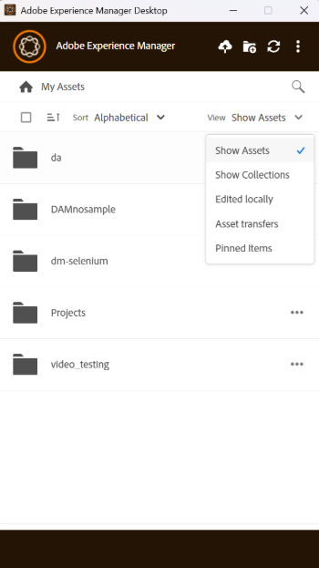

# Assets Management-taken in [!DNL AEM Desktop App] {#assets-management-tasks}

Middelenbeheer omvat het organiseren, onderhouden en optimaliseren van digitale middelen om workflows te stroomlijnen. Dit omvat taken zoals het dupliceren en hernoemen van bestanden, het vastzetten of verwijderen van mappen voor snelle toegang, en het weergeven van elementen in verschillende lay-outs. Dit verbetert de efficiëntie, vereenvoudigt het bijhouden van bedrijfsmiddelen en zorgt ervoor dat digitale middelen eenvoudig kunnen worden opgehaald en geordend op verschillende platforms.

## Elementen weergeven {#view-assets}

Met AEM Desktop App kunt u elementen weergeven in vier verschillende weergaven:

* **[!UICONTROL Show Assets]:** Staat u toe om alle activa te bekijken.
* **[!UICONTROL Show Collections]:** Hiermee kunt u alle verzamelingen weergeven die in de native AEM-toepassing zijn gemaakt. Zie meer [ inzamelingen ](#collections-desktop-app).
* **[!UICONTROL Edited Locally]:** Hiermee kunt u alle lokaal gewijzigde elementen weergeven. In deze weergave kunt u meerdere elementen toevoegen en uploaden.
* **[!UICONTROL Asset transfers]:** Hiermee kunt u alle elementen weergeven die van de native app naar de lokale of andersom zijn overgebracht.
* **[!UICONTROL Pinned items]:** Hiermee kunt u alle vastgezette items weergeven.

Voer de volgende stappen uit om te kiezen uit de verschillende weergaven van middelen in de AEM Desktop-app:

1. Open AEM Desktop App.

1. Ga naar de vervolgkeuzelijst rechtsboven in het scherm. Kies een van de beschikbare weergaven.

    uit

## Nieuw toegevoegde mappen en bestanden weergeven {#view-newly-added-files-folders}

U kunt nieuw gemaakte middelen uploaden van uw lokale computer naar AEM, waar de centrale opslagplaats is opgeslagen. Als u deze nieuwe elementen lokaal wilt weergeven, gaat u naar het vervolgkeuzemenu **[!UICONTROL View]** en selecteert u **[!UICONTROL Show Assets]** om alle updates met hun tijdlijn en titels weer te geven, of selecteert u **[!UICONTROL Edited Locally]** . Beide opties tonen expliciet de lokaal bewerkte elementen.

## Bestanden dupliceren {#duplicate-files}

Wanneer u een origineel bestand wilt behouden en wijzigingen wilt aanbrengen in het vergelijkbare bestand, kunt u bestanden op verschillende locaties (lokaal en in de cloud) tegelijk dupliceren. Dit kan worden bereikt door dubbele bestandsbewerkingen uit te voeren tussen elementen.

Voer de volgende stappen uit om bestanden te dupliceren in AEM Desktop App:

1. Blader naar een map en selecteer het element dat u wilt dupliceren.

   

1. Klik **[!UICONTROL More actions]**  en selecteer  **[!UICONTROL Duplicate File]** actie.

1. Het gedupliceerde bestand wordt gemaakt met dezelfde bestandsnaam en inhoud.

## De naam van een element of map wijzigen {#rename-asset-title}

Voer de onderstaande stappen uit om de naam van een element of map te wijzigen:

1. Blader door het element waarvan u de naam wilt wijzigen. Speciale tekens zoals `\ / : * ?  | < > [ ] %` zijn niet toegestaan wanneer u een map een naam geeft. Indien opgenomen worden ze automatisch vervangen door een afbreekstreepje `-` .

1. Klik **[!UICONTROL More actions]**  en selecteer **[!UICONTROL Rename]** om uw gewenste titel van een activa toe te voegen.

## Map vastzetten of vastzetten {#pin-unpin-folder}

Vastgezette mappen worden automatisch gesynchroniseerd om eventuele wijzigingen weer te geven die native in de app zijn aangebracht. Voor snelle toegang kunt u een map vastzetten of vrijmaken door de onderstaande stappen uit te voeren:

1. Blader door het element dat u wilt vastzetten of vrijmaken.

1. Klik **[!UICONTROL More actions]**  en selecteer [!UICONTROL pin] om de activa of de omslag vast te zetten. U kunt ook op [!UICONTROL unpin] klikken om het vastzetten ongedaan te maken.

    uit

## Automatisch vernieuwen {#auto-refresh}

Met de functie Automatisch vernieuwen wordt inhoud automatisch in real-time bijgewerkt. Zo weet u zeker dat u altijd de meest recente informatie ziet zonder de pagina handmatig opnieuw te laden. Voer de onderstaande stappen uit om elementen automatisch te vernieuwen om de lijst met bijgewerkte elementen op te halen:

1. Open AEM Desktop App.

1. Klik  op de menubar om de updates te krijgen.

## Verzamelingen {#collections-desktop-app}

AEM App van de Desktop staat u toe om [ te bekijken, ](#view-collections-desktop-app) download [ en doorblader inzamelingen die op ](#download-collections-desktop-app) toepassing worden gecreeerd.[!DNL Adobe Experience Manager Assets]

### Verzamelingen weergeven {#view-collections-desktop-app}

Voer de volgende stappen uit om verzamelingen in de bureaubladtoepassing weer te geven:

1. Open App van de Desktop van AEM en ga naar [ meningsactiva ](#view-assets).

1. Selecteer **[!UICONTROL Show Collections]**. De verzamelingen die beschikbaar zijn in de oorspronkelijke toepassing, worden weergegeven.

   

### Verzamelingen downloaden {#download-collections-desktop-app}

Voer de volgende stappen uit om verzamelingen in de bureaubladtoepassing te downloaden:

1. Volg stappen 1 en 2 zoals aangetoond in [ meningsinzamelingen ](#view-collections-desktop-app).

1. Ga naar meer acties  op de inzameling die u wilt downloaden.

1. Klik op **[!UICONTROL Download]** om de desbetreffende verzameling te downloaden.

## Map maken met metagegevensschema {#create-folder-with-metadata-schema}

Met de AEM Desktop App kunt u metagegevens toewijzen tijdens het maken van een nieuwe map. Voer daartoe de volgende stappen uit:

1. Ga om folderpictogram tot stand te brengen  toe. **[!UICONTROL Create Directory]** wordt weergegeven.

1. Voeg de volgende details toe:
   * **[!UICONTROL Name]** van de map.
   * **[!UICONTROL Folder Metadata Schema]** om een hiërarchie van metagegevens in de map te kiezen of kies **[!UICONTROL none]** als u er geen metagegevens aan wilt koppelen.

1. Klik op **[!UICONTROL OK]** om verder te gaan.

## Lijst van overgedragen elementen {#list-of-transferred-assets}

Om de lijst van activa te bekijken die in een bepaalde zitting worden overgebracht, zie [ activa uploaden aan  [!DNL Experience Manager]](#upload-and-add-new-assets-to-aem).

## Geavanceerde workflow: samenwerken aan dezelfde bestanden en bewerkingsconflicten voorkomen {#adv-workflow-collaborate-avoid-conflicts}

In samenwerkingsomgevingen kunnen meerdere gebruikers werken aan dezelfde set elementen die tot versieconflicten kunnen leiden. Volg de volgende aanbevolen procedures om conflicten te voorkomen:

* Bewerk geen elementen door op [!UICONTROL Open] te klikken. Bewerk de lokaal gedownloade elementen niet door deze te openen vanuit de bestandssysteemmap. Andere gebruikers weten niet dat het element wordt bewerkt.
* Als u een element wilt bewerken, klikt u altijd op [!UICONTROL Edit] . Het element wordt geopend in de oorspronkelijke toepassing en er wordt een vergrendelingspictogram toegevoegd aan het element, zodat de andere gebruikers weten dat het element wordt bewerkt.
* Klik op [!UICONTROL Toggle Check-in] als u per ongeluk begint met bewerken zonder op [!UICONTROL Edit] te klikken. Met deze functie voegt u een vergrendelingspictogram toe aan het element. Zelfs als u een element later wilt bewerken, maar u wilt voorkomen dat anderen het bewerken, klikt u op [!UICONTROL Toggle Check-in] om het element te vergrendelen.
* Voordat u een element bewerkt, moet u ervoor zorgen dat andere gebruikers het element niet bewerken. Zoek het slotpictogram op de activa.
* Na het voltooien van de bewerkingen uploadt u alle wijzigingen en checkt u het element in.

Als een lokaal gedownload element wordt bijgewerkt op de [!DNL Experience Manager] -server, geeft de app een **[!UICONTROL Modified remotely]** -status weer. U kunt de lokale kopie verwijderen of de lokale kopie vernieuwen door respectievelijk op [!UICONTROL Remove] of [!UICONTROL Update] te klikken. Met de koppelingen in het dialoogvenster kunt u beide versies van het element weergeven.

Als een middel dat u lokaal bewerkt ook zonder uw medeweten op de server wordt bijgewerkt, geeft de app een **[!UICONTROL Editing Conflict]** status weer. U kunt één set wijzigingen behouden. U kunt de updates behouden (klik op **[!UICONTROL Keep Mine]** ) en de bewerking van de andere gebruiker verwijderen, of de updates van de andere gebruiker respecteren en uw wijzigingen verwijderen (**[!UICONTROL Overwrite Mine]** ).

 op te lossen

## Geavanceerde workflow: middelen plaatsen en koppelen in InDesign-bestand {#adv-workflow-place-assets-indesign}

Wanneer u de bureaubladtoepassing van [!DNL Experience Manager] gebruikt om bestanden met gekoppelde elementen te openen, worden de elementen vooraf gedownload en in de oorspronkelijke toepassingen geplaatst. Deze workflow werkt alleen als uw oorspronkelijke toepassing het plaatsen van koppelingen naar lokale elementen ondersteunt en [!DNL Experience Manager] het oplossen van deze koppelingen in binaire bestanden naar verwijzingen naar de server ondersteunt.

De bureaubladtoepassing van [!DNL Experience Manager] ondersteunt deze workflow met een aantal geselecteerde Adobe Creative Cloud-bureaubladtoepassingen en -bestandsindelingen - Adobe InDesign, Adobe Illustrator en Adobe Photoshop. Met de workflow kunt u efficiënt werken met de ondersteunde Creative Cloud-bestanden. Als gebruiker A elementen toevoegt aan een InDesign-bestand en dit incheckt in [!DNL Experience Manager] , kan gebruiker B de elementen in het bestand zien, ook al maken deze geen deel uit van het bestand. De middelen worden plaatselijk gedownload op de machine van gebruiker B.

>[!NOTE]
>
>De bureaubladtoepassing kan worden toegewezen aan elk station in Windows. Wijzig de standaardstationsletter echter niet voor vloeiende bewerkingen. Als gebruikers van dezelfde organisatie verschillende stationsletters gebruiken, kunnen ze de elementen die door anderen zijn geplaatst, niet zien. De geplaatste elementen worden niet opgehaald wanneer het pad verandert. De geplaatste elementen blijven in het binaire bestand (bijvoorbeeld INDD) staan en worden niet verwijderd.

Om de beperkingen van dit werkschema te kennen, zie de [ systeemvereisten en gesteunde versies ](release-notes.md).

Voer de volgende stappen uit om deze workflow te testen met een afbeeldingselement en InDesign:

1. Behoud een INDD-bestand met geplaatste elementen in [!DNL Experience Manager]. Om te weten hoe te om zulk een INDD dossier tot stand te brengen, zie [ Plaatsende Grafieken ](https://helpx.adobe.com/indesign/using/placing-graphics.html).
1. Vanuit de bureaubladtoepassing **[!UICONTROL Edit]** wordt het INDD-bestand met elementen in [!DNL Experience Manager] geplaatst.
1. De app downloadt het InDesign-bestand en de gekoppelde middelen. Wanneer InDesign het document opent, worden de koppelingen opgelost, worden de elementen gedownload en worden de elementen weergegeven in het InDesign-document.
1. Als u een nieuwe afbeelding in het InDesign-bestand wilt plaatsen, gebruikt u de handeling **[!UICONTROL Reveal File]** op het element. De actie downloadt plaatselijk activa en opent de lokale plaats van het netwerkaandeel in de Ontdekkingsreiziger van Vensters of de Vinder van Mac.
1. Plaats het onthulde element in het InDesign-document. Hiermee maakt u een koppeling in het document.
1. Nadat u de bewerkingen in het InDesign-document hebt voltooid, slaat u het document op en uploadt u het naar [!DNL Experience Manager] met de bureaubladtoepassing.

## Volgende stappen {#next-steps}

* [ bekijk een video om met App van de Desktop van Adobe Experience Manager ](https://experienceleague.adobe.com/en/docs/experience-manager-learn/assets/creative-workflows/aem-desktop-app) te beginnen te worden

* Verstrek documentatie terugkoppelt gebruikend [!UICONTROL Edit this page]  of [!UICONTROL Log an issue]  beschikbaar op juiste sidebar

* De Zorg van de Klant van het contact 

<!--* Provide product feedback using the [!UICONTROL Feedback] option available on the AEM Desktop App user interface>-->

>[!MORELIKETHIS]
>
>* [ begrijp het gebruikersinterface ](/help/using/user-interface.md).
>* [ krijgen begonnen gids ](/help/using/get-started.md).
