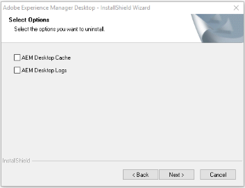

# Installeer de bureaubladtoepassing [!DNL Adobe Experience Manager] {#install-app-v2}

Met de bureaubladtoepassing van [!DNL Adobe Experience Manager] kunt u de middelen in [!DNL Experience Manager] eenvoudig gebruiken op uw lokale bureaublad en gebruiken in alle native bureaubladtoepassingen. Assets kan worden voorvertoond en geopend in bureaubladtoepassingen. Ze kunnen in Finder of Verkenner zichtbaar worden gemaakt voor gebruik in documenten en lokaal worden bewerkt. Wijzigingen worden weer opgeslagen in [!DNL Experience Manager] . Er wordt een nieuwe versie gemaakt wanneer u de bestanden uploadt.

Een dergelijke integratie maakt het mogelijk verschillende rollen in de organisatie te vervullen:

* Beheer de elementen centraal in [!DNL Experience Manager Assets].

* Open de middelen in om het even welke inheemse Desktoptoepassingen, met inbegrip van derdetoepassingen en in Adobe Creative Cloud. De gebruikers kunnen zich daarbij gemakkelijk aan de verschillende normen houden, waaronder branding.

Zo gebruikt u de bureaubladtoepassing van [!DNL Experience Manager] :

* Controleer of uw [!DNL Experience Manager] -versie compatibel is met de bureaubladtoepassing van [!DNL Experience Manager] .

* Download en installeer de toepassing. Zie [&#x200B; Desktop app &#x200B;](#install-v2) hieronder installeren.

* Test de verbinding met behulp van een paar elementen. Zie [&#x200B; om naar activa &#x200B;](search.md#browse-search-preview-assets) te doorbladeren en te zoeken.

## Systeemvereisten, vereisten en downloadkoppelingen {#tech-specs-v2}

Voor gedetailleerde informatie, zie de [[!DNL Experience Manager]  nota&#39;s van de de toepassingsversie van de Desktop &#x200B;](release-notes.md).

## Upgrade uitvoeren vanaf een vorige versie {#upgrade-from-previous-version}

Als u een gebruiker bent van v1.x van de bureaubladtoepassing, begrijpt u de verschillen en overeenkomsten tussen de vorige en de laatste versie van de app. Zie [&#x200B; wat in Desktop app &#x200B;](introduction.md#whats-new-v2) nieuw is en [&#x200B; hoe app &#x200B;](release-notes.md#how-app-works) werkt.

>[!NOTE]
>
>Twee versies van een bureaubladtoepassing kunnen niet naast elkaar bestaan op een computer. Verwijder de andere versie voordat u een versie installeert.

Voer de volgende instructies uit om een upgrade uit te voeren van een vorige versie van de app:

1. Voordat u de upgrade uitvoert, moet u al uw middelen synchroniseren en uw wijzigingen uploaden naar [!DNL Experience Manager] . Zo voorkomt u dat u bewerkingen kwijtraakt wanneer u de app verwijdert.

1. Verwijder de vorige versie van de app. Selecteer bij het verwijderen de optie om de cache te wissen.

1. Start de computer opnieuw op.

1. [&#x200B; Download &#x200B;](release-notes.md) en [&#x200B; installeer &#x200B;](#install-v2) recentste app. Volg de onderstaande instructies.

## Installeren {#install-v2}

Voer de volgende stappen uit om de bureaubladtoepassing te installeren. Verwijder een bestaande Adobe [!DNL Experience Manager] desktop app v1.x voordat u de nieuwste app installeert. Zie hierboven voor meer informatie.

1. Download het recentste installatieprogramma van de [&#x200B; versienota&#39;s &#x200B;](release-notes.md) pagina.

1. Houd de URL en de referenties van de implementatie van [!DNL Experience Manager] goed bij de hand.

1. Als u van een andere versie van app bevordert, zie [&#x200B; verbeteringDesktop app &#x200B;](#upgrade-from-previous-version).

1. Sla deze stap over als u [!DNL Experience Manager] als een [!DNL Cloud Service] , [!DNL Experience Manager] 6.4.4 of hoger of [!DNL Experience Manager] 6.5.0 of hoger gebruikt. Zorg ervoor dat uw [!DNL Experience Manager] opstelling aan de verenigbaarheidsvereisten voldoet die in de [&#x200B; worden vermeld versienota&#39;s &#x200B;](release-notes.md). Indien nodig, download het toepasselijke [&#x200B; verenigbaarheidspakket &#x200B;](https://experience.adobe.com/#/downloads/content/software-distribution/en/aem.html?package=/content/software-distribution/en/details.html/content/dam/aem/public/adobe/packages/cq640/featurepack/adobe-asset-link-support) en installeer het gebruikend de [!DNL Experience Manager] Manager van het Pakket als [!DNL Experience Manager] beheerder. Om een pakket te installeren, zie [&#x200B; hoe te met Pakketten &#x200B;](https://experienceleague.adobe.com/nl/docs/experience-manager-65/content/sites/administering/contentmanagement/package-manager) werken.

1. Voer het installatieprogramma binair uit en volg de instructies op het scherm om te installeren.

1. In Windows wordt mogelijk gevraagd om `Visual Studio C++ Redistributable 2015` te installeren. Volg de aanwijzingen op het scherm om de installatie uit te voeren. Als de installatie mislukt, installeert u deze handmatig. [&#x200B; Download het installatieprogramma &#x200B;](https://www.microsoft.com/en-us/download/details.aspx?id=52685) en installeer zowel `vc_redist.x64.exe` als `vc_redist.x86.exe` dossiers. Voer het installatieprogramma van de [!DNL Experience Manager] -bureaubladtoepassing opnieuw uit.

1. Start de computer opnieuw naar wens. Start en configureer de bureaubladtoepassing.

1. Als u de app wilt verbinden met een [!DNL Experience Manager] -opslagplaats, klikt u op het pictogram van de app in de lade en start u de app. Geef het adres van de [!DNL Experience Manager] -server op in de notatie `https://[aem_server]:[port]/` .

   Klik op **[!UICONTROL Connect]** en geef de referenties op.

   

   *Cijfer: Het scherm van de verbinding aan het adres van de inputserver.*

   Selecteer **[!UICONTROL Remember Connection]** om te voorkomen dat u de verbindingsgegevens opgeeft wanneer u zich aanmeldt bij de bureaubladtoepassing.

   >[!CAUTION]
   >
   >Zorg ervoor dat er geen voorloopspaties of navolgende spaties zijn voor of na het adres van de [!DNL Experience Manager] -server. Anders kan de toepassing geen verbinding maken met de [!DNL Experience Manager] -server.

1. [ Facultatieve ] klik **[!UICONTROL I want to connect a different way]** en klik **[!UICONTROL Adobe login]** om aan de server van Experience Manager Assets het programma te openen gebruikend de Dienst van Adobe Identity Management (IMS). Met de IMS-aanmelding kan de bureaubladtoepassing de toegangstoken automatisch vernieuwen, zodat de gebruiker zich maximaal 14 dagen kan aanmelden. Klik op **[!UICONTROL Direct login]** om de standaardaanmelding bij de [!DNL Experience Manager] -server uit te voeren aan de hand van de gebruikersgegevens.

   

1. Als de verbinding is gelukt, kunt u de lijst met mappen en middelen weergeven die beschikbaar zijn in de hoofdmap van de [!DNL Experience Manager] DAM. U kunt vanuit de app door de mappen bladeren.

   

   *Figuur: De toepassing toont de inhoud DAM na login*

1. ([!DNL Experience Manager] 6.5.1 of hoger) Als u de bureaubladtoepassing gebruikt met [!DNL Experience Manager] 6.5.1 of hoger, voert u een upgrade uit van S3 of Azure-aansluiting naar versie 1.10.4 of hoger. Zie [&#x200B; Azure schakelaar &#x200B;](https://experienceleague.adobe.com/nl/docs/experience-manager-65/content/implementing/deploying/deploying/data-store-config#azure-data-store) of [&#x200B; S3 schakelaar &#x200B;](https://experienceleague.adobe.com/nl/docs/experience-manager-65/content/implementing/deploying/deploying/data-store-config#amazon-s-data-store).

   Neem contact op met de klantenondersteuning van Adobe als u een Adobe Managed Services (AMS)-klant bent.

## Voorkeuren instellen {#set-preferences}

Om voorkeur te veranderen, klik  en **[!UICONTROL Preference]** . Pas in het **[!UICONTROL Preferences]** -venster de waarden van het volgende aan:

* [!UICONTROL Launch the application on logon].

* [!UICONTROL Show a window when the application starts].

* **[!UICONTROL Cache Directory]**: locatie van de lokale cache van de app (deze bevat de lokaal gedownloade elementen).

* **[!UICONTROL Network Drive Letter]**: De stationsletter die wordt gebruikt om de [!DNL Experience Manager] DAM toe te wijzen. Wijzig deze stationsletter van het netwerk niet als u niet zeker bent. De app kan aan elke stationsletter in Windows worden toegewezen. Als twee gebruikers elementen van verschillende stationsletters plaatsen, kunnen ze de elementen die door elkaar zijn geplaatst niet zien. Het pad van de elementen wordt gewijzigd. De elementen blijven in het binaire bestand (bijvoorbeeld INDD) staan en worden niet verwijderd. In de app worden alle beschikbare stationsletters vermeld en standaard wordt de laatst beschikbare letter gebruikt die doorgaans `Z` is.

* **[!UICONTROL Maximum Cache Size]**: Toegestane cache op de vaste schijf in GB die wordt gebruikt voor het opslaan van lokaal gedownloade elementen.

* **[!UICONTROL Current cache size]**: Opslaggrootte van de lokaal gedownloade elementen. De informatie wordt alleen weergegeven nadat middelen zijn gedownload met de app.

* **[!UICONTROL Automatically download linked assets]**: Wanneer u het oorspronkelijke bestand downloadt, worden elementen die in ondersteunde native Creative Cloud-toepassingen zijn geplaatst, automatisch opgehaald.

* **[!UICONTROL Maximum number of downloads]**:  Verandering met voorzichtigheid. Wanneer voor het eerst elementen worden gedownload (via de optie Tonen, Openen, Bewerken, Downloaden of een vergelijkbare optie), worden de elementen alleen gedownload als de batch minder dan dit nummer bevat. De standaardwaarde is 50. Niet wijzigen als u het niet zeker weet. Als u de waarde verhoogt, kan het langer duren. Als u de waarde verlaagt, kan het zijn dat u niet alle benodigde elementen of mappen in één poging kunt downloaden.

* **[!UICONTROL Use legacy conventions when creating nodes for assets and folders]**:  Verandering met voorzichtigheid. Met deze instelling kan de toepassing het gedrag van de v1.10-app emuleren tijdens het uploaden van mappen. In v1.10, respecteren de knoopnamen die in de bewaarplaats worden gecreeerd de ruimten en het omhulsel van de omslagnamen die door de gebruiker worden verstrekt. In versie 2.1 van de app worden de extra spaties in de mapnamen echter geconverteerd naar streepjes. Als u bijvoorbeeld `New Folder` of `new   folder` uploadt, wordt hetzelfde knooppunt in de repository gemaakt als de optie niet is geselecteerd en het standaardgedrag in v2.1 behouden blijft. Als deze optie is geselecteerd, worden in de opslagplaats voor de bovenstaande twee mappen verschillende knooppunten gemaakt die overeenkomen met de werking van de v1.10-app.

  Het standaardgedrag van v2.1 blijft ongewijzigd: het vervangt meerdere spaties in mapnamen door streepjes in de naam van de opslagplaats en zet knooppuntnamen om in kleine letters.

* **[!UICONTROL Upload Acceleration]**:  Verandering met voorzichtigheid. Bij het uploaden van elementen kan de toepassing gelijktijdige uploads gebruiken om de uploadsnelheid te verbeteren. U kunt de gelijktijdige uitvoering van het uploaden verhogen door de schuifregelaar naar rechts te verplaatsen. De schuifregelaar aan de linkerkant betekent geen gelijktijdige uitvoering (single-threaded upload), de middelste positie komt overeen met tien gelijktijdige threads en de maximale limiet aan de rechterkant komt overeen met 20 gelijktijdige threads. Een hogere gelijktijdige limiet is meer hulpbronnenintensief.

Als u de niet-beschikbare voorkeuren wilt bijwerken, meldt u zich af bij de [!DNL Experience Manager] -server en werkt u de voorkeuren vervolgens bij. Na het bijwerken van de voorkeur, klik .


*Cijfer: Desktop app voorkeur.*

### Proxyondersteuning {#proxy-support}

De bureaubladtoepassing [!DNL Experience Manager] gebruikt de vooraf gedefinieerde proxy van het systeem om via HTTPS verbinding te maken met internet. De toepassing kan alleen verbinding maken met een netwerkproxy waarvoor geen extra verificatie is vereist.

Als u de instellingen van de proxyserver voor Windows configureert of wijzigt (Internet-opties > LAN-instellingen), start u de [!DNL Experience Manager] -bureaubladtoepassing opnieuw zodat de wijzigingen van kracht worden. Proxyconfiguratie wordt toegepast wanneer u de bureaubladtoepassing start. Sluit de app en start de app opnieuw om de wijzigingen door te voeren.

Als uw proxy verificatie vereist, kan het IT-team de [!DNL Experience Manager Assets] URL in de instellingen van de proxyserver toestaan om het toepassingsverkeer door te geven.

## De toepassing verwijderen {#uninstall-the-app}

Voer de volgende stappen uit om de installatie van de toepassing in Windows ongedaan te maken:

1. Upload al uw wijzigingen naar [!DNL Experience Manager] om te voorkomen dat er bewerkingen verloren gaan. Zie [&#x200B; activa uitgeven en bijgewerkte activa aan  [!DNL Experience Manager]](upload-assets.md#edit-assets-upload-updated-assets) uploaden. Log uit en [!UICONTROL Exit] de app.

1. Verwijder de app als u andere besturingssysteemtoepassingen verwijdert. Verwijder de software uit de programma&#39;s Toevoegen en Verwijderen in Windows.

1. Als u de cache en logbestanden wilt verwijderen, schakelt u het vereiste selectievakje in.

   

1. Volg de aanwijzingen op het scherm. Start de computer opnieuw op wanneer u klaar bent.

Voer de volgende stappen uit om de installatie van de toepassing op Mac te verwijderen:

1. Upload al uw wijzigingen naar [!DNL Experience Manager] om te voorkomen dat er bewerkingen verloren gaan. Zie [&#x200B; activa uitgeven en bijgewerkte activa aan  [!DNL Experience Manager]](upload-assets.md#edit-assets-upload-updated-assets) uploaden. Log uit en [!UICONTROL Exit] de app.

1. Verwijder `Adobe Experience Manager Desktop.app` uit `/Applications`.

Als u de interne cache van toepassingen op de Mac wilt opschonen en de toepassing wilt verwijderen, kunt u de volgende opdracht ook in de terminal uitvoeren:

```shell
/Applications/Adobe Experience Manager Desktop/Contents/Resources/uninstall-osx/uninstall.sh
```
