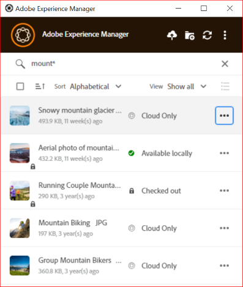

# Zoeken, zoeken en voorvertonen van elementen {#browse-search-preview-assets}

U kunt vanuit de bureaubladtoepassing bladeren naar de elementen die beschikbaar zijn in de [!DNL Experience Manager] -opslagplaats, deze zoeken en er een voorvertoning van weergeven. Probeer het volgende in de app:

1. Blader naar een map en bekijk basisinformatie over de middelen die beschikbaar zijn in de map, samen met kleine miniaturen van alle elementen.

   

1. Klik op de bestandsnaam als u meer informatie en een grotere miniatuur van een afzonderlijk element wilt bekijken.

   

1. Klik op **[!UICONTROL Open]** of **[!UICONTROL Edit]** om het bestand lokaal te downloaden en het in respectievelijk de oorspronkelijke toepassing weer te geven of te bewerken.
1. Zoek met behulp van trefwoorden naar een verwant element in de [!DNL Experience Manager] -opslagplaats. Gebruik `?` en `*` als jokertekens. Deze jokertekens vervangen een enkel teken of meerdere tekens. Filter de resultaten en sorteer deze zo nodig.

   

   

>[!NOTE]
>
>In de app worden de elementen weergegeven door de zoekcriteria af te stemmen op meerdere metagegevensvelden en niet alleen op de titel van het element of de bestandsnaam.

## Elementen op uw bureaublad openen {#openondesktop-v2}

U kunt de externe middelen openen voor weergave in de oorspronkelijke toepassing. De middelen worden gedownload naar een lokale map. Vervolgens worden ze gestart in de oorspronkelijke toepassing die aan de bestandsindeling is gekoppeld. U kunt de oorspronkelijke toepassing wijzigen en specifieke bestandstypen (extensies) openen in uw Mac of Windows.

Klik op **[!UICONTROL Open]** in het menu Middelen. Het element wordt lokaal gedownload en in de oorspronkelijke toepassing geopend. Controleer de voortgang van het downloaden en de overdrachtssnelheid van grote middelen op de statusbalk.

<!-- 
-->

>[!NOTE]
>
>Als de verwachte veranderingen niet in app worden weerspiegeld, verfrist de klik pictogram  of klikt met de rechtermuisknop in app interface en klikt **[!UICONTROL Refresh]**. De acties zijn niet beschikbaar wanneer grotere downloads of uploads worden uitgevoerd.

Om de lokale downloadomslag van een activa te openen, klik  en klik  **[!UICONTROL Reveal File]** actie.

## Elementen gebruiken of plaatsen in eigen documenten {#place-assets-in-native-documents}

In sommige gevallen, bijvoorbeeld wanneer het plaatsen van activa in een inheems document, hebt u toegang tot een dossier in de Ontdekkingsreiziger van Vensters of de Vinder van Mac. Om aan de plaats van het dossiersysteem van het plaatselijk gedownloade dossier te krijgen, gebruik  **[!UICONTROL Reveal File]** optie onthullen.

Klik op **[!UICONTROL Reveal File]** of **[!UICONTROL Reveal Folder]** in een map om Windows Verkenner of de Finder van Mac te openen met het bestand of de map die vooraf op uw lokale computer is geselecteerd. De optie is bijvoorbeeld handig om de [!DNL Experience Manager] -bestanden te plaatsen in de native toepassingen die het plaatsen of koppelen van lokale bestanden ondersteunen. Om te zien hoe te om dossiers in Adobe InDesign te plaatsen, zie [&#x200B; Plaatsende grafiek &#x200B;](https://helpx.adobe.com/nl/indesign/using/placing-graphics.html).

Met de handeling **[!UICONTROL Reveal File]** wordt een lokaal gedeelde netwerk geopend. Alleen de elementen die lokaal beschikbaar zijn, worden weergegeven. Dit betekent dat er elementen worden weergegeven die met de app zijn onthuld, gedownload of geopend/bewerkt. Het lokale netwerkaandeel uploadt geen veranderingen in [!DNL Experience Manager]. Als u de wijzigingen wilt uploaden, gebruikt u expliciet de handelingen **[!UICONTROL Upload Changes]** of **[!UICONTROL Upload]** in de app.

>[!NOTE]
>
>Voor achterwaartse compatibiliteit met [!DNL Experience Manager] desktop app v1.x, worden de vrijgegeven bestanden via een lokaal netwerkaandeel gebruikt, waarbij alleen lokaal beschikbare bestanden beschikbaar worden gemaakt. De bureaubladpaden van de onthulde bestanden zijn gelijk aan de paden die door app v1.x worden gemaakt.

>[!CAUTION]
>
>Gebruik de optie **[!UICONTROL Reveal File]** niet om elementen in native toepassingen te bewerken. Gebruik in plaats daarvan de handelingen **[!UICONTROL Edit]** . Meer weten, zie [&#x200B; Geavanceerd werkschema: werk aan de zelfde dossiers samen en vermijd het uitgeven conflicten &#x200B;](#adv-workflow-collaborate-avoid-conflicts).

### Speciale tekens in elementnamen beheren {#special-characters-in-filename}

In de verouderde app behielden de namen van knooppunten die in de repository zijn gemaakt de ruimten en behuizing van de mapnamen die door de gebruiker zijn verschaft. Schakel [!UICONTROL Use legacy conventions when creating nodes for assets and folders] in de [!UICONTROL Preferences] in als de huidige toepassing de regels voor nodenamen van de v1.10-app moet emuleren. Zie [&#x200B; app voorkeur &#x200B;](/help/using/install-upgrade.md#set-preferences). Deze oudere voorkeur is standaard uitgeschakeld.

>[!NOTE]
>
>De app wijzigt alleen de knooppuntnamen in de repository met behulp van de volgende naamconventies. De app behoudt de `Title` van het element zoals deze is.

| Tekens ‡ | Oudere voorkeur in app | Wanneer voorkomen in bestandsnamen | Indien voorkomend in mapnamen | Voorbeeld |
|---|---|---|---|---|
| `. / : [ ] \| *` | In- of uitgeschakeld | Vervangen door `-` (afbreekstreepje). Een `.` (punt) in de bestandsnaamextensie blijft ongewijzigd. | Vervangen door `-` (afbreekstreepje). | `myimage.jpg` blijft ongewijzigd en `my.image.jpg` verandert in `my-image.jpg` . |
| `% ; # , + ? ^ { } "` en spaties |  Gehandicapte | Werkruimten blijven behouden | Vervangen door `-` (afbreekstreepje). | `My Folder.` verandert in `my-folder-` . |
| `# % { } ? & .` |  Gehandicapte | Vervangen door `-` (afbreekstreepje). | NA. | `#My New File.` verandert in `-My New File-` . |
| Hoofdletters |  Gehandicapte | Trappen blijft ongewijzigd. | Veranderd in kleine letters. | `My New Folder` verandert in `my-new-folder` . |
| Hoofdletters |  Toegelaten | Trappen blijft ongewijzigd. | Trappen blijft ongewijzigd. | NA. |

‡ De lijst met tekens is een lijst met door spaties gescheiden tekens.

## Alle bewerkte afbeeldingen zoeken {#find-all-edited-images}

De toepassing biedt een weergave met de naam **[!UICONTROL Edited locally]** , waarmee u snel toegang krijgt tot alle bestanden die u lokaal hebt gedownload (via [!UICONTROL Open] - of [!UICONTROL Edit] -acties) en die u vervolgens wijzigt. Met de app kunt u alle lokaal bewerkte elementen selecteren en de wijzigingen met een paar klikken uploaden. In deze weergave worden ook de lokaal bewerkte elementen weergegeven die een bewerkingsconflict hebben.

## Volgende stappen {#next-steps}

* [&#x200B; bekijk een video om met App van de Desktop van Adobe Experience Manager &#x200B;](https://experienceleague.adobe.com/nl/docs/experience-manager-learn/assets/creative-workflows/aem-desktop-app) te beginnen te worden

* Verstrek documentatie terugkoppelt gebruikend [!UICONTROL Edit this page]  of [!UICONTROL Log an issue]  beschikbaar op juiste sidebar

* De Zorg van de Klant van het contact [&#128279;](https://experienceleague.adobe.com/nl?support-solution=General#support)

>[!MORELIKETHIS]
>
>* [&#x200B; Begrijp het gebruikersinterface &#x200B;](/help/using/user-interface.md)
>* [&#x200B; Gebruikend de Toepassing van de Desktop &#x200B;](/help/using/using-desktop-app.md)
>* [&#x200B; Beherend Assets in de Toepassing van de Desktop &#x200B;](/help/using/assets-management-tasks.md)
