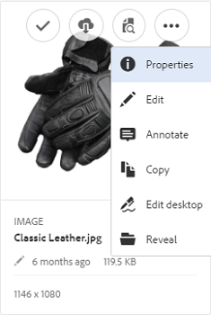
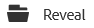

# Gebruiken [!DNL Experience Manager] desktop app v1.10 {#use-aem-desktop-app-v1x}

De elementen binnen de app gebruiken [!DNL Experience Manager] zijn gemakkelijk toegankelijk op uw lokale bureaublad en kunnen in om het even welke Desktoptoepassingen worden gebruikt. Assets kan eenvoudig worden weergegeven in Mac Finder of Windows Verkenner, worden geopend in bureaubladtoepassingen en lokaal worden gewijzigd. De wijzigingen worden opgeslagen in [!DNL Experience Manager] met een nieuwe versie die in de repository is gemaakt.

Deze integratie maakt gecentraliseerd beheer van bedrijfsmiddelen en toegang voor Creatives Cloud en andere toepassingen mogelijk en zorgt ervoor dat de bedrijfsmiddelen en andere standaarden worden nageleefd.

De belangrijkste taken die u doet gebruikend [!DNL Experience Manager] desktop app v1 bevat:

1. [Verbinding maken met een [!DNL Experience Manager] server](#installandconnect)
1. [Elementen rechtstreeks openen in de bureaubladtoepassing](#openondesktop)
1. [Elementen bewerken en uitchecken vanuit de bureaubladtoepassing](#workonassets)
1. [Elementen en mappen bulksgewijs uploaden](#bulkupload)

Zie voor de verschillende aanbevolen doseringen en aanbevolen doseringen de [tips en trucs voor het gebruik van de bureaubladtoepassing](best-practices-for-v1.md). Als u problemen ondervindt met de app, kunt u zien hoe u [problemen oplossen [!DNL Experience Manager] bureaubladtoepassing](troubleshoot-app-v1.md).

>[!NOTE]
>
>De bureaubladtoepassing is geïntroduceerd in [!DNL Experience Manager] 6.1 release en gebeld [!DNL Experience Manager Assets Companion App].

## [!DNL Experience Manager] aanraakpunten voor bureaubladtoepassingen in de creatieve workflow {#aem-desktop-app-touch-points-in-the-creative-workflow}

[!DNL Experience Manager] bureaubladtoepassing, samen met [!DNL Assets], integreert in uw creatieve werkstroom en biedt de volgende aanraakpunten.

![[!DNL Experience Manager] desktop app touch wijst de creatieve workflow aan](assets/aem_desktopapp_workflow.png)

[!DNL Experience Manager] desktop app touch wijst de creatieve workflow aan

## De toepassing installeren en verbinden met de [!DNL Experience Manager] server {#installandconnect}

Voordat u kunt beginnen met het maken of bewerken van de creatieve elementen, moet u de bureaubladtoepassing verbinden met de [!DNL Assets] om elementen in de repository te downloaden en uploaden. Voer de volgende taken uit:

1. [De toepassing installeren](#installapp).
1. [Uw voorkeuren instellen](#inapppref) en verbindingsgegevens.
1. [Verbinding maken met een [!DNL Experience Manager] server](#connect) en monteer de opslagplaats van middelen als lokaal station.
1. [Bureaubladhandelingen inschakelen](#desktopactions) op de [!DNL Experience Manager] server.

De [!DNL Experience Manager] bureaubladtoepassing gebruikt een HTTPS-verbinding om verbinding te maken met [!DNL Experience Manager] server om uw middelen stevig en veilig over te brengen.

>[!NOTE]
>
>Voor alle of een deel van de installatie en configuratiestappen, kunt u hulp van uw nodig hebben [!DNL Experience Manager] beheerder of systeembeheerder.

### De toepassing installeren {#installapp}

Zorg ervoor dat de app uw versie van de Experience Manager-server ondersteunt om de Experience Manager desktop-app te gebruiken. Download het juiste (binaire) installatiebestand voor uw besturingssysteem (Mac of Windows) en installeer de toepassing.

Afhankelijk van uw netwerk- en systeemvoorkeuren kan een gedetailleerde configuratie nodig zijn. Zie [Installeren en configureren [!DNL Experience Manager] bureaubladtoepassing](install-configure-app-v1.md) voor meer informatie .

1. Ga naar de [[!DNL Experience Manager] downloadpagina voor bureaubladtoepassing v1.10](/help/using/release-notes-of-v1.md) en download het juiste binaire bestand voor uw besturingssysteem.
1. Start het gedownloade installatiebestand en volg de aanwijzingen op het scherm om de app te installeren.

   >[!NOTE]
   >
   >Slechts één instantie van de [!DNL Experience Manager] bureaubladtoepassing kan worden geïnstalleerd en tegelijk actief zijn.

### Begrijp de opties en voorkeuren in de app {#inapppref}

In de toepassing kunnen instellingen verbinding maken en de verbinding verbreken [!DNL Experience Manager] servers, de status van uploads bekijken, lokale cache beheren, enzovoort. De standaardinstellingen werken voor een standaardgebruiker van de toepassing. U kunt de instellingen aanpassen om meer uit de toepassing te halen. En meer uit de integratie met de [!DNL Experience Manager] server. Hier volgen de verschillende instellingen:

**Assets verkennen** Open het lokale station waarin de [!DNL Assets] opslagplaats is gekoppeld. Met andere woorden, verken de middelen die nu op uw lokale computer beschikbaar worden gesteld.

**Elementstatus weergeven** Wanneer gewijzigde elementen zijn geüpload of nieuwe elementen worden toegevoegd aan de [!DNL Assets] de toepassing uploadt de middelen op de achtergrond. Met de uploaden naar de achtergrond kunt u vloeiende bewerkingen uitvoeren, zonder dat u hoeft te wachten tot het uploaden is voltooid, met name voor grote elementen. U kunt uw wijzigingen lokaal opslaan en deze vergeten. Het duurt enige tijd voordat de toepassing deze middelen naar de server verzendt, afhankelijk van de beschikbare bandbreedte. U kunt de status van de upload controleren, samen met wat meer basisinformatie.

**Opties** Klik op opties in de bureaubladtoepassingslade om de app in te stellen die bij het opstarten moet worden gestart, en verbinding te maken met de [!DNL Experience Manager] server bij opstarten en de lokale stationsletter wijzigen voor [!DNL Assets] na montage.

**Geavanceerd > Cache beheren** U kunt bepalen hoeveel schijfruimte beschikbaar is voor lokale caching-doeleinden. De artefacten van de [!DNL Assets] De server wordt lokaal in cache geplaatst voor een vloeiendere ervaring. U kunt de standaardinstellingen aanpassen aan uw wensen. Bovendien kunt u de cache wissen om alle elementen opnieuw op te halen. Als u de cache wist, blijven de niet-opgeslagen wijzigingen behouden. Alle elementen die niet zijn geselecteerd in het dialoogvenster [!DNL Experience Manager] server worden behouden en niet verwijderd.

### Verbinding maken met een [!DNL Experience Manager] server {#connect}

De toepassing ondersteunt proxyconfiguratie in Mac en Windows. De configuratie wordt gelezen wanneer de app wordt gestart. Als u proxyinstellingen wijzigt, start u de toepassing opnieuw zodat de wijzigingen van kracht worden.

>[!NOTE]
>
>Als u de proxyinstellingen wijzigt, start u de toepassing opnieuw zodat de wijzigingen van kracht worden. Anders blijft de toepassing de eerder geconfigureerde proxyserver gebruiken.

1. De [!DNL Experience Manager] bureaubladtoepassing. Om uw [!DNL Experience Manager] -instantie met de app, geeft u uw [!DNL Experience Manager] server in de indeling `https://[aem-server-url]:[port]`.

   ![Verifiëren op Mac en verstrekken [!DNL Experience Manager] server-URL](assets/aem_desktop_app_server_url.png)

1. Geef in het aanmeldingsscherm de gebruikersnaam en het wachtwoord voor de instantie op. Een alternatief opgeven [!DNL Experience Manager] -instantie, selecteert u de **[!UICONTROL Alternate Login URL]** -optie.

   ![Verlenen [!DNL Experience Manager] serverreferenties op het aanmeldingsscherm op [!DNL Experience Manager] bureaubladtoepassing](assets/login_screen_v1.png)

### Bureaubladhandelingen inschakelen in [!DNL Experience Manager] webinterface {#desktopactions}

Vanuit de Assets-gebruikersinterface kunt u de locaties van middelen verkennen of de middelen uitchecken en het middel openen voor bewerking in uw desktoptoepassing. Deze opties worden desktophandelingen genoemd en worden niet standaard ingeschakeld. Voer de volgende stappen uit om deze in te schakelen.

1. Klik/tik in de Assets-interface op het gebruikerspictogram in de rechterbovenhoek van de werkbalk.
1. Klikken **[!UICONTROL My Preferences]** om de **[!UICONTROL Preferences]** in.

   ![[!DNL Experience Manager] interface met gebruikersvoorkeuren](assets/aem_ui_user_preferences.png)

1. In de [!UICONTROL User Preferences] dialoogvenster, selecteren **[!UICONTROL Show Desktop Actions For Assets]** en klik vervolgens op **[!UICONTROL Accept]**.

   ![Controleren [!UICONTROL Show Desktop Actions For Assets] om bureaubladhandelingen in te schakelen](assets/enable_desktop_actions.png)

   *Afbeelding: Controle [!UICONTROL Show Desktop Actions For Assets] om de acties op het bureaublad in te schakelen.*

## Elementen openen en openen op uw bureaublad {#openondesktop}

Wanneer u op **Openen** om middelen op uw lokale computer te openen, downloadt de app de middelen naar de interne cache. De app start de native bureaubladtoepassing die is gekoppeld aan het bestandstype van het gedownloade element.

Selecteer in Mac **Openen** in het contextmenu om een element te openen via de [!DNL Experience Manager] bureaubladtoepassing. In Windows selecteert u Openen op web in het contextmenu om het element te openen. Klik/tik in het venster Asset Status  om het element te openen.

Selecteer bij Adobe InDesign-bestanden (INDD) de optie **[!UICONTROL Open]** in het contextmenu. Wanneer u op deze optie klikt, downloadt de app de gekoppelde elementen naar uw lokale bestandssysteem en wordt het INDD-bestand in Adobe InDesign geopend. Deze methode zorgt ervoor dat de benodigde elementen lokaal beschikbaar zijn wanneer u het INDD-bestand bewerkt.

![Contextmenu-opties voor toegang tot en het openen van elementen met behulp van [!DNL Experience Manager] bureaubladtoepassing](assets/aem_desktopapp_mac_context_menu.png)

*Afbeelding: Contextmenu-opties voor toegang tot en het openen van elementen met behulp van de opdracht [!DNL Experience Manager] bureaubladtoepassing.*

>[!NOTE]
>
>De Adobe raadt u aan naar de Weergaveopties voor Finder op Mac te gaan en de opties te deactiveren **Itemgegevens tonen**, **Voorvertoning van item weergeven**, en **Voorvertoningskolom tonen** voor de gemonteerde [!DNL Assets] map. Het verbetert de prestaties.

### Aanvullende opties in [!DNL Experience Manager] interface {#additional-options-in-aem-assets}

Nadat u de [!DNL Assets] kunt u extra pictogrammen en de functie Map uploaden inschakelen om te worden weergegeven voor de toegewezen elementen en mappen.

1. Open de [!DNL Assets] en plaats de aanwijzer boven een map of element om de bureaubladacties als snelle acties weer te geven in de kaartweergave.

   

   *Afbeelding: Open in de gebruikersinterface van Assets het menu Handelingen Snel om acties op het bureaublad weer te geven.*

   Deze bureaubladacties zijn ook beschikbaar wanneer u op de knop **Bureaubladhandelingen** in de werkbalk nadat u het element op de werkbalk op de elementpagina hebt geselecteerd.

1. Als u het element wilt openen in de bureaubladtoepassing die is gekoppeld aan de specifieke bestandsextensie, klikt u op de knop **Openen op bureaublad** snelle actie .

   U kunt ook **Openen** van de **Bureaubladhandelingen** op de werkbalk.

Als u het specifieke element op uw lokale bestandssysteem wilt zoeken, klikt u op **Tonen** snelle actie . U kunt ook **Tonen** van de **Bureaubladhandelingen** op de werkbalk.

## De status van elementen begrijpen {#understand-the-asset-statuses}

|  | De app is verbonden met de server en alle middelen zijn gesynchroniseerd. |
--- |--- |
|  | De app wordt gestart, maar heeft geen verbinding met de server. Sommige elementen zijn mogelijk in afwachting van synchronisatie. |
|  | Assets synchroniseert. Bestanden worden geüpload of gedownload. U kunt de exacte status zien en de overdrachten pauzeren vanuit het venster Asset Status. |
|  | App probeert opnieuw verbinding te maken. Mogelijk wordt de verbinding verbroken door de netwerkproblemen. |

## Werken met uw elementen {#workonassets}

### Elementen uitchecken vanuit de [!DNL Experience Manager] webinterface {#check-out-assets-from-the-aem-web-interface}

[!DNL Experience Manager Assets] Hiermee kunt u elementen uitchecken voor bewerking en ze weer inchecken nadat u alle wijzigingen hebt aangebracht. Nadat u een element hebt uitgecheckt, kunt u het element alleen bewerken, annoteren, publiceren, verplaatsen of verwijderen. Als u een element uitcheckt, vergrendelt u het element en voorkomt u dat andere gebruikers deze bewerkingen uitvoeren. Om activa te kunnen uitchecken/inchecken, hebt u schrijftoegang op hen nodig.

Er zijn twee manieren om middelen van te controleren [!DNL Experience Manager] webinterface. Voor gedetailleerde informatie over de eerste methode raadpleegt u de [inchecken en uitchecken van bestanden via gebruikersinterface van Assets](https://experienceleague.adobe.com/en/docs/experience-manager-65/content/assets/managing/check-out-and-submit-assets). Voer de volgende stappen uit voor de tweede methoden om het element uit te checken en te openen wanneer de [!DNL Experience Manager] bureaubladtoepassing is geïnstalleerd.

1. Open de [!DNL Assets] en plaats de aanwijzer boven een map of element om de bureaubladacties als snelle acties weer te geven in de kaartweergave.

   

   Deze bureaubladacties zijn ook beschikbaar wanneer u op het pictogram Bureaubladhandelingen op de werkbalk klikt of tikt nadat u het element of de werkbalk op de elementpagina hebt geselecteerd.

1. Als u het element wilt openen, klikt of tikt u op de handeling Openen op bureaublad .

   U kunt ook Openen kiezen in het menu Bureaubladhandelingen op de werkbalk.

   >[!NOTE]
   >
   >Wanneer u een geopend maar niet-uitgecheckt bestand bewerkt, weten andere gebruikers niet dat u het element bijwerkt.

1. Als u een element wilt openen voor bewerking in een Adobe Creative Cloud-toepassing, klikt u op . Met deze optie wordt het element ook uitgecheckt voor bewerking. Nadat u klaar bent met bewerken, checkt u het element in om de wijzigingen bij te werken in [!DNL Assets].

   U kunt ook Bewerken kiezen in het menu Bureaubladhandelingen op de werkbalk.

1. Selecteer de menuoptie Openen. De geselecteerde elementen worden geopend in de voorvertoningsmodus.
1. Selecteer de optie Bewerken om de elementen te bewerken. De elementen worden geopend in de bewerkingsmodus.

### Middelen uitchecken vanuit Finder op macOS {#check-out-assets-on-mac}

Met de app kunt u elementbestanden uitchecken om te voorkomen dat andere gebruikers de bestanden wijzigen waaraan u werkt.

1. Selecteer in het contextmenu van Mac de optie AEM Assets-map openen om de Finder te openen.

   ![Contextmenu-opties voor toegang tot en het openen van elementen met behulp van [!DNL Experience Manager] bureaubladtoepassing](assets/aem_desktopapp_mac_context_menu.png)

   *Afbeelding: Contextmenu-opties voor toegang tot en het openen van elementen met behulp van de opdracht [!DNL Experience Manager] bureaubladtoepassing.*

1. Navigeer naar het element dat u wilt uitchecken.
1. Klik met de rechtermuisknop op het element en selecteer Meer Assets-informatie in het contextmenu.
1. Klik/tik op het pictogram Uitchecken in het dialoogvenster Asset Info om het element uit te checken. Het pictogram Uitchecken schakelt over naar het pictogram voor inchecken nadat u erop hebt geklikt of getikt.

   

1. Als u het element wilt inchecken zodat het beschikbaar is voor andere gebruikers, klikt of tikt u op het incheckpictogram in het dialoogvenster Elementinfo.

### Elementen in Windows uitchecken {#check-out-assets-on-windows}

Met de app kunt u elementbestanden uitchecken om te voorkomen dat andere gebruikers de bestanden wijzigen waaraan u werkt.

1. Selecteer in het contextmenu de optie Assets verkennen om Verkenner te openen.
1. Navigeer in Verkenner naar de locatie van het element dat u wilt uitchecken.
1. Klik met de rechtermuisknop op het element en selecteer Openen op web in het contextmenu.
1. Klik in het dialoogvenster Elementinfo op het pictogram Uitchecken. Met het pictogram Uitchecken schakelt u over naar het pictogram voor inchecken.

   

1. Controleer het element in Verkenner. Het vergrendelingspictogram op het element  Hiermee wordt aangegeven dat u het element hebt uitgecheckt.

   >[!NOTE]
   >
   >Het slotpictogram kan na wat vertraging verschijnen. De [!DNL Experience Manager] de bureaubladtoepassing plaatst de elementen in cache zodat deze snel toegankelijk zijn, zodat het even kan duren voordat de vergrendelde status wordt bijgewerkt.

1. Als u het element wilt inchecken zodat het beschikbaar is voor andere gebruikers, klikt of tikt u op het pictogram voor inchecken in het dialoogvenster **Elementinfo** in.

### Middelen inchecken met Finder of Explorer en webinterface gebruiken {#check-in-an-asset-using-finder-or-explorer-and-using-web-interface}

Wanneer u klaar bent met het bewerken van de elementen, slaat u de elementen op in uw bureaubladtoepassing. Selecteer in het contextmenu de optie **Meer informatie over Assets** en klik op Inchecken.

De elementen worden geüpload naar de [!DNL Experience Manager] server. U kunt desgewenst de status van de upload controleren door **Status van element weergeven** uit het systeemvakpictogram. U kunt ook een element inchecken vanuit het [!DNL Experience Manager] webinterface. Klik op de uitgecheckte elementen of selecteer deze. Klik op het pictogram Inchecken op de werkbalk .

Een element is geüpload naar [!DNL Experience Manager] automatisch nadat eventuele wijzigingen lokaal zijn opgeslagen. Het inchecken stelt het middel ter beschikking van andere [!DNL Experience Manager] gebruikers voor bewerking.

### Elementen en mappen uploaden in bulk naar [!DNL Experience Manager] server {#bulkupload}

Met de [!DNL Experience Manager] bureaubladtoepassing, kunt u een volledige map uploaden met elementen van uw lokale bestandsmap naar [!DNL Assets]. Op deze manier worden alle elementen in de map in bulk geüpload in plaats van ze een voor een te hoeven uploaden.

1. Klik/tik vanuit de gebruikersinterface van Assets **Maken** in de werkbalk en vervolgens in het menu selecteert u **Map uploaden**.
1. Blader naar de map die u wilt uploaden en selecteer deze.
1. Klik op OK/tik op OK. In het dialoogvenster Assets-status wordt de status van het uploaden weergegeven.

   

   De status van de upload bekijken in het venster Asset Status

   >[!NOTE]
   >
   >U kunt het uploaden handmatig pauzeren of annuleren door op het juiste pictogram te klikken of erop te tikken.

1. Nadat de map is geüpload, sluit u het dialoogvenster en navigeert u naar de gebruikersinterface van Assets. De geüploade map wordt weergegeven in de webinterface.

Adobe raadt kopiëren en plakken niet aan of het slepen van een groter aantal bestanden of geneste mappen vanuit het lokale bestandssysteem naar het gedeelde netwerkgebied. De toepassing kan het uploadproces niet beheren vanwege technische beperkingen en de prestaties zijn slecht.

U kunt ook bestanden/mappen selecteren in Finder of Verkenner, deze kopiëren, naar de doelmap navigeren in het gebied voor netwerkdeling en **Assets plakken** van de [!DNL Experience Manager] contextmenu van bureaubladtoepassing. Op deze manier [!DNL Experience Manager] bureaubladtoepassing start met het uploaden van de geplakte middelen, vergelijkbaar met **Map uploaden** beschikbaar in het dialoogvenster [!DNL Experience Manager] webinterface.

>[!MORELIKETHIS]
>
>* [Problemen oplossen [!DNL Experience Manager] bureaubladtoepassing](troubleshoot-app-v1.md)
