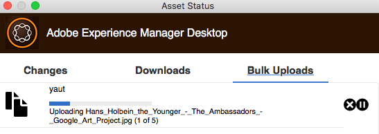

# [!DNL Experience Manager] desktop app v1.10 gebruiken {#use-aem-desktop-app-v1x}

Met de app zijn de elementen in [!DNL Experience Manager] gemakkelijk toegankelijk op uw lokale bureaublad en kunnen deze worden gebruikt in alle bureaubladtoepassingen. Assets kan eenvoudig worden weergegeven in Mac Finder of Windows Verkenner, worden geopend in bureaubladtoepassingen en lokaal worden gewijzigd. De wijzigingen worden dan weer opgeslagen in [!DNL Experience Manager] met een nieuwe versie die in de opslagplaats is gemaakt.

Deze integratie maakt gecentraliseerd beheer van bedrijfsmiddelen en toegang voor Creatives Cloud en andere toepassingen mogelijk en zorgt ervoor dat de bedrijfsmiddelen en andere standaarden worden nageleefd.

De belangrijkste taken die u uitvoert met de [!DNL Experience Manager] desktop app v1 zijn:

1. [Verbind met een  [!DNL Experience Manager]  server](#installandconnect)
1. [Elementen rechtstreeks openen in de bureaubladtoepassing](#openondesktop)
1. [Elementen bewerken en uitchecken vanuit de bureaubladtoepassing](#workonassets)
1. [Elementen en mappen bulksgewijs uploaden](#bulkupload)

Voor diverse geadviseerde doet en niet, zie de [&#x200B; beste praktijken voor het gebruiken van Desktop app &#x200B;](best-practices-for-v1.md). Als u kwesties gebruikend App onder ogen ziet, hoe te [&#x200B;  [!DNL Experience Manager]  Desktop app &#x200B;](troubleshoot-app-v1.md) problemen oplossen.

>[!NOTE]
>
>De desktop-app is geïntroduceerd in [!DNL Experience Manager] 6.1-release en heet [!DNL Experience Manager Assets Companion App] .

## [!DNL Experience Manager] aanraakpunten voor bureaubladtoepassingen in de creatieve workflow {#aem-desktop-app-touch-points-in-the-creative-workflow}

De bureaubladtoepassing van [!DNL Experience Manager] integreert, samen met [!DNL Assets] , in uw creatieve workflow en biedt de volgende aanraakpunten.

![[!DNL Experience Manager] desktop app touch-points the creative workflow &#x200B;](assets/aem_desktopapp_workflow.png)

[!DNL Experience Manager] desktop app touch-points de creatieve workflow

## De toepassing installeren en verbinden met de [!DNL Experience Manager] -server {#installandconnect}

Voordat u kunt beginnen met het maken of bewerken van creatieve middelen, sluit u de bureaubladtoepassing aan op de [!DNL Assets] -server om elementen te downloaden en uploaden in de opslagplaats. Voer de volgende taken uit:

1. [&#x200B; installeer app &#x200B;](#installapp).
1. [&#x200B; plaats uw voorkeur &#x200B;](#inapppref) en verbindingsdetails.
1. [&#x200B; verbind met een  [!DNL Experience Manager]  server &#x200B;](#connect) en onderstel activa bewaarplaats als lokale aandrijving.
1. [&#x200B; laat Desktopacties &#x200B;](#desktopactions) op de [!DNL Experience Manager] server toe.

De desktop-app van [!DNL Experience Manager] gebruikt een HTTPS-verbinding om verbinding te maken met de [!DNL Experience Manager] -server om uw elementen robuust en veilig over te brengen.

>[!NOTE]
>
>Voor alle of een deel van de installatie- en configuratiestappen hebt u wellicht hulp nodig van uw [!DNL Experience Manager] -beheerder of -systeembeheerder.

### De toepassing installeren {#installapp}

Zorg ervoor dat de app uw versie van de Experience Manager-server ondersteunt om de Experience Manager desktop-app te gebruiken. Download het juiste (binaire) installatiebestand voor uw besturingssysteem (Mac of Windows) en installeer de toepassing.

Afhankelijk van uw netwerk- en systeemvoorkeuren kan een gedetailleerde configuratie nodig zijn. Zie [&#x200B; installeer en vorm  [!DNL Experience Manager]  Desktop app &#x200B;](install-configure-app-v1.md) voor meer details.

1. Ga naar de [[!DNL Experience Manager]  Desktop app v1.10 downloadpagina &#x200B;](/help/using/release-notes-of-v1.md) en download aangewezen binair voor uw werkend systeem.
1. Start het gedownloade installatiebestand en volg de aanwijzingen op het scherm om de app te installeren.

   >[!NOTE]
   >
   >Er kan slechts één exemplaar van de [!DNL Experience Manager] -bureaubladtoepassing worden geïnstalleerd en tegelijk actief zijn.

### Begrijp de opties en voorkeuren in de app {#inapppref}

De toepassing stelt instellingen in staat om verbinding te maken met en de verbinding met [!DNL Experience Manager] -servers te verbreken, de status van uploads weer te geven, de lokale cache te beheren, enzovoort. De standaardinstellingen werken voor een standaardgebruiker van de toepassing. U kunt de instellingen aanpassen om meer uit de toepassing te halen. En, krijg meer uit de integratie met de [!DNL Experience Manager] server. Hier volgen de verschillende instellingen:

**Onderzoek Assets** Open de lokale aandrijving waarin de [!DNL Assets] bewaarplaats wordt opgezet. Met andere woorden, verken de middelen die nu op uw lokale computer beschikbaar worden gesteld.

**de elementstatus van de Mening** wanneer de veranderde activa worden geupload of de nieuwe activa aan de [!DNL Assets] bewaarplaats worden toegevoegd, uploadt de toepassing de activa op de achtergrond. Met de uploaden naar de achtergrond kunt u vloeiende bewerkingen uitvoeren, zonder dat u hoeft te wachten tot het uploaden is voltooid, met name voor grote elementen. U kunt uw wijzigingen lokaal opslaan en deze vergeten. Het duurt enige tijd voordat de toepassing deze middelen naar de server verzendt, afhankelijk van de beschikbare bandbreedte. U kunt de status van de upload controleren, samen met wat meer basisinformatie.

**Opties** klik opties in de Desktop toepassingsdienblad om app te plaatsen om bij opstarten te lanceren, met de [!DNL Experience Manager] server te verbinden bij lancering, en de lokale aandrijvingsbrief voor [!DNL Assets] na het opzetten te veranderen.

**Geavanceerd > beheert geheim voorgeheugen** u kunt de hoeveelheid schijfruimte controleren die voor lokale caching doeleinden ter beschikking wordt gesteld. De artefacten van de [!DNL Assets] -server worden lokaal in het cachegeheugen opgeslagen voor een vloeiender ervaring. U kunt de standaardinstellingen aanpassen aan uw wensen. Bovendien kunt u de cache wissen om alle elementen opnieuw op te halen. Als u de cache wist, blijven de niet-opgeslagen wijzigingen behouden. Elementen die niet zijn ingecheckt op de [!DNL Experience Manager] -server, blijven behouden en worden niet verwijderd.

### Verbinding maken met een [!DNL Experience Manager] -server {#connect}

De toepassing ondersteunt proxyconfiguratie in Mac en Windows. De configuratie wordt gelezen wanneer de app wordt gestart. Als u proxyinstellingen wijzigt, start u de toepassing opnieuw zodat de wijzigingen van kracht worden.

>[!NOTE]
>
>Als u de proxyinstellingen wijzigt, start u de toepassing opnieuw zodat de wijzigingen van kracht worden. Anders blijft de toepassing de eerder geconfigureerde proxyserver gebruiken.

1. Start de bureaubladtoepassing van [!DNL Experience Manager] . Als u de [!DNL Experience Manager] -instantie wilt toewijzen met de app, geeft u de [!DNL Experience Manager] server op in de notatie `https://[aem-server-url]:[port]` .

   ![&#x200B; verifieert op Mac en verstrekt [!DNL Experience Manager] server URL &#x200B;](assets/aem_desktop_app_server_url.png)

1. Geef in het aanmeldingsscherm de gebruikersnaam en het wachtwoord voor de instantie op. Als u een alternatieve [!DNL Experience Manager] -instantie wilt opgeven, selecteert u de optie **[!UICONTROL Alternate Login URL]** .

   ![&#x200B; verstrekken [!DNL Experience Manager] servergeloofsbrieven op het login scherm op [!DNL Experience Manager] Desktop app &#x200B;](assets/login_screen_v1.png)

### Bureaubladhandelingen inschakelen in de webinterface van [!DNL Experience Manager] {#desktopactions}

Vanuit de Assets-gebruikersinterface kunt u de locaties van middelen verkennen of de middelen uitchecken en het middel openen voor bewerking in uw desktoptoepassing. Deze opties worden desktophandelingen genoemd en worden niet standaard ingeschakeld. Voer de volgende stappen uit om deze in te schakelen.

1. Klik/tik in de Assets-interface op het gebruikerspictogram in de rechterbovenhoek van de werkbalk.
1. Klik op **[!UICONTROL My Preferences]** om het dialoogvenster **[!UICONTROL Preferences]** weer te geven.

   ![[!DNL Experience Manager] interface met gebruikersvoorkeuren &#x200B;](assets/aem_ui_user_preferences.png)

1. Selecteer **[!UICONTROL Show Desktop Actions For Assets]** in het dialoogvenster [!UICONTROL User Preferences] en klik vervolgens op **[!UICONTROL Accept]** .

   ![&#x200B; Controle [!UICONTROL Show Desktop Actions For Assets] om Desktopacties &#x200B;](assets/enable_desktop_actions.png) toe te laten

   *Cijfer: Controle [!UICONTROL Show Desktop Actions For Assets] om de Desktopacties toe te laten.*

## Elementen openen en openen op uw bureaublad {#openondesktop}

Wanneer u **Open** klikt om activa op uw lokale computer te openen, downloadt app de activa aan zijn intern geheime voorgeheugen. De app start de native bureaubladtoepassing die is gekoppeld aan het bestandstype van het gedownloade element.

Op Mac, uitgezochte **Open** van het contextmenu om activa door [!DNL Experience Manager] Desktop app te openen. In Windows selecteert u Openen op web in het contextmenu om het element te openen. Van het venster van de Status van Activa, klik/tik  om de activa te openen.

Voor Adobe InDesign-bestanden (INDD) selecteert u **[!UICONTROL Open]** in het contextmenu. Wanneer u op deze optie klikt, downloadt de app de gekoppelde elementen naar uw lokale bestandssysteem en wordt het INDD-bestand in Adobe InDesign geopend. Deze methode zorgt ervoor dat de benodigde elementen lokaal beschikbaar zijn wanneer u het INDD-bestand bewerkt.

![&#x200B; het menuopties van de context om tot activa toegang te hebben en te openen gebruikend [!DNL Experience Manager] Desktop app &#x200B;](assets/aem_desktopapp_mac_context_menu.png)

*Figuur: De menuopties van de context om tot activa toegang te hebben en te openen gebruikend [!DNL Experience Manager] Desktop app.*

>[!NOTE]
>
>De Adobe adviseert dat u naar de Opties van de Mening van de Vinder op Mac gaat en de opties **desactiveert tonen puntinfo**, **toont puntoverzicht**, en **toont voorproefkolom** voor de opgezette [!DNL Assets] omslag. Het verbetert de prestaties.

### Aanvullende opties in de interface [!DNL Experience Manager] {#additional-options-in-aem-assets}

Nadat u de [!DNL Assets] opslagplaats aan uw lokale aandrijving in kaart hebt gebracht, kunt u extra pictogrammen toelaten en de eigenschap van het Uploaden van de Omslag om voor de in kaart gebrachte activa en omslagen te verschijnen.

1. Open de interface van [!DNL Assets] en houd de aanwijzer boven een map of element om de bureaubladacties als snelle acties weer te geven in de kaartweergave.

    te zien

   *Figuur: In Assets UI, open het snelle actiemenu om Desktopacties te zien.*

   Deze Desktopacties zijn ook beschikbaar wanneer u de **optie van de Acties van de Desktop** in de toolbar klikt na het selecteren van de activa of van de toolbar in de activapagina.

1. Om de activa in de Desktoptoepassing te openen die met de specifieke dossieruitbreiding wordt geassocieerd, klik **Open op Desktop** snelle actie .

   Alternatief, kies **Open** van het **menu van de Acties van de Desktop** in de toolbar.

Om van de bijzondere activa op uw lokaal dossiersysteem de plaats te bepalen, klik **onthullen snelle actie  onthullen.** Alternatief, kies **onthullen** van het **menu van de Acties van de Desktop** in de toolbar.

## De status van elementen begrijpen {#understand-the-asset-statuses}

|  | De app is verbonden met de server en alle middelen zijn gesynchroniseerd. |
--- |--- |
|  | De app wordt gestart, maar heeft geen verbinding met de server. Sommige elementen zijn mogelijk in afwachting van synchronisatie. |
|  | Assets synchroniseert. Bestanden worden geüpload of gedownload. U kunt de exacte status zien en de overdrachten pauzeren vanuit het venster Asset Status. |
|  | App probeert opnieuw verbinding te maken. Mogelijk wordt de verbinding verbroken door de netwerkproblemen. |

## Werken met uw elementen {#workonassets}

### Elementen uitchecken via de webinterface van [!DNL Experience Manager] {#check-out-assets-from-the-aem-web-interface}

Met [!DNL Experience Manager Assets] kunt u elementen uitchecken en deze opnieuw inchecken nadat u alle wijzigingen hebt aangebracht. Nadat u een element hebt uitgecheckt, kunt u het element alleen bewerken, annoteren, publiceren, verplaatsen of verwijderen. Als u een element uitcheckt, vergrendelt u het element en voorkomt u dat andere gebruikers deze bewerkingen uitvoeren. Om activa te kunnen uitchecken/inchecken, hebt u schrijftoegang op hen nodig.

Er zijn twee manieren om elementen uit de webinterface van [!DNL Experience Manager] te controleren. Voor gedetailleerde informatie over de eerste methode, zie [&#x200B; controle en controlerende dossiers van Assets UI &#x200B;](https://experienceleague.adobe.com/nl/docs/experience-manager-65/content/assets/managing/check-out-and-submit-assets). Voer de volgende stappen uit voor de tweede methoden om het element uit te checken en te openen wanneer de [!DNL Experience Manager] -bureaubladtoepassing wordt geïnstalleerd.

1. Open de interface van [!DNL Assets] en houd de aanwijzer boven een map of element om de bureaubladacties als snelle acties weer te geven in de kaartweergave.

   

   Deze bureaubladacties zijn ook beschikbaar wanneer u op het pictogram Bureaubladhandelingen op de werkbalk klikt of tikt nadat u het element of de werkbalk op de elementpagina hebt geselecteerd.

1. Om de activa te openen, klik/tik Open op Desktop snelle actie .

   U kunt ook Openen kiezen in het menu Bureaubladhandelingen op de werkbalk.

   >[!NOTE]
   >
   >Wanneer u een geopend maar niet-uitgecheckt bestand bewerkt, weten andere gebruikers niet dat u het element bijwerkt.

1. Om activa voor het uitgeven in een toepassing van Adobe Creative Cloud te openen, klik . Met deze optie wordt het element ook uitgecheckt voor bewerking. Nadat u klaar bent met bewerken, checkt u het element in om de wijzigingen in [!DNL Assets] bij te werken.

   U kunt ook Bewerken kiezen in het menu Bureaubladhandelingen op de werkbalk.

1. Selecteer de menuoptie Openen. De geselecteerde elementen worden geopend in de voorvertoningsmodus.
1. Selecteer de optie Bewerken om de elementen te bewerken. De elementen worden geopend in de bewerkingsmodus.

### Middelen uitchecken vanuit Finder op macOS {#check-out-assets-on-mac}

Met de app kunt u elementbestanden uitchecken om te voorkomen dat andere gebruikers de bestanden wijzigen waaraan u werkt.

1. Selecteer in het contextmenu van Mac de optie AEM Assets-map openen om de Finder te openen.

   ![&#x200B; het menuopties van de context om tot activa toegang te hebben en te openen gebruikend [!DNL Experience Manager] Desktop app &#x200B;](assets/aem_desktopapp_mac_context_menu.png)

   *Figuur: De menuopties van de context om tot activa toegang te hebben en te openen gebruikend [!DNL Experience Manager] Desktop app.*

1. Navigeer naar het element dat u wilt uitchecken.
1. Klik met de rechtermuisknop op het element en selecteer Meer Assets-informatie in het contextmenu.
1. Klik/tik op het pictogram Uitchecken in het dialoogvenster Asset Info om het element uit te checken. Het pictogram Uitchecken schakelt over naar het pictogram voor inchecken nadat u erop hebt geklikt of getikt.

   

1. Als u het element wilt inchecken zodat het beschikbaar is voor andere gebruikers, klikt of tikt u op het incheckpictogram in het dialoogvenster Elementinfo.

### Elementen in Windows uitchecken {#check-out-assets-on-windows}

Met de app kunt u elementbestanden uitchecken om te voorkomen dat andere gebruikers de bestanden wijzigen waaraan u werkt.

1. Selecteer in het contextmenu de optie Assets verkennen om Verkenner te openen.
1. Navigeer in Verkenner naar de locatie van het element dat u wilt uitchecken.
1. Klik met de rechtermuisknop op het element en selecteer Openen op web in het contextmenu.
1. Klik in het dialoogvenster Elementinfo op het pictogram Uitchecken. Met het pictogram Uitchecken schakelt u over naar het pictogram voor inchecken.

   

1. Controleer het element in Verkenner. Het slotpictogram op de activa  wijst erop dat u de activa hebt uitgecheckt.

   >[!NOTE]
   >
   >Het slotpictogram kan na wat vertraging verschijnen. De bureaubladtoepassing van [!DNL Experience Manager] plaatst de elementen in de cache zodat het enkele ogenblikken kan duren voordat de vergrendelde status wordt bijgewerkt.

1. Om in de activa te controleren zodat is het beschikbaar aan andere gebruikers, klik/tik het controle-binnen pictogram in de **dialoog van Info van Activa**.

### Middelen inchecken met Finder of Explorer en webinterface gebruiken {#check-in-an-asset-using-finder-or-explorer-and-using-web-interface}

Wanneer u klaar bent met het bewerken van de elementen, slaat u de elementen op in uw bureaubladtoepassing. Van het contextmenu, uitgezochte **Meer Info van Assets** en klik controle-binnen.

De elementen worden geüpload naar de [!DNL Experience Manager] -server. Naar keuze, kunt u de status van uploaden controleren door **de Status van Activa van de Mening** van het pictogram van het systeemdienblad te selecteren. U kunt een element ook inchecken via de webinterface van [!DNL Experience Manager] . Klik op de uitgecheckte elementen of selecteer deze. Van de toolbar, klik het controle-binnen pictogram .

Middelen worden automatisch naar [!DNL Experience Manager] geüpload nadat eventuele wijzigingen lokaal zijn opgeslagen. Met het inchecken kunt u het element ter beschikking stellen van andere [!DNL Experience Manager] -gebruikers voor bewerking.

### Elementen en mappen uploaden in bulk naar de [!DNL Experience Manager] -server {#bulkupload}

Met de bureaubladtoepassing van [!DNL Experience Manager] kunt u een volledige map met elementen uit de lokale bestandsmap uploaden naar [!DNL Assets] . Op deze manier worden alle elementen in de map in bulk geüpload in plaats van ze een voor een te hoeven uploaden.

1. Van Assets UI, klik/tik **creeert** van de toolbar, en dan van het menu, uitgezochte **uploadt Omslag**.
1. Blader naar de map die u wilt uploaden en selecteer deze.
1. Klik op OK/tik op OK. In het dialoogvenster Assets-status wordt de status van het uploaden weergegeven.

   

   De status van de upload bekijken in het venster Asset Status

   >[!NOTE]
   >
   >U kunt het uploaden handmatig pauzeren of annuleren door op het juiste pictogram te klikken of erop te tikken.

1. Nadat de map is geüpload, sluit u het dialoogvenster en navigeert u naar de gebruikersinterface van Assets. De geüploade map wordt weergegeven in de webinterface.

Adobe raadt kopiëren en plakken niet aan of het slepen van een groter aantal bestanden of geneste mappen vanuit het lokale bestandssysteem naar het gedeelde netwerkgebied. De toepassing kan het uploadproces niet beheren vanwege technische beperkingen en de prestaties zijn slecht.

Alternatief, uitgezochte dossiers/omslagen in Vinder of Ontdekkingsreiziger, kopieer hen, navigeer aan de doelomslag in het gebied van het netwerkaandeel, en kies **Deeg Assets** van het [!DNL Experience Manager] Desktop app contextmenu. Op deze manier, begint de [!DNL Experience Manager] Desktop app de geplakte activa te uploaden gelijkend op **uploaden de optie van de Omslag** beschikbaar in de [!DNL Experience Manager] Webinterface.

>[!MORELIKETHIS]
>
>* [&#x200B; los  [!DNL Experience Manager]  Desktop app toepassing &#x200B;](troubleshoot-app-v1.md) problemen op
