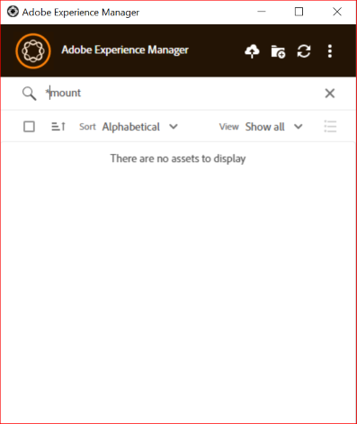

# [!DNL Adobe Experience Manager] bureaubladtoepassing gebruiken  {#use-aem-desktop-app-v2}

Gebruik de bureaubladtoepassing van [!DNL Adobe Experience Manager] om toegang te krijgen tot digitale elementen die zijn opgeslagen in een [!DNL Adobe Experience Manager] DAM-opslagplaats op uw lokale bureaublad. U kunt deze middelen dan in om het even welke Desktoptoepassingen gebruiken. U kunt de elementen lokaal openen en bewerken in bureaubladtoepassingen. Nadat u wijzigingen hebt aangebracht, uploadt u deze weer naar [!DNL Experience Manager] met versiebeheer om updates met andere gebruikers te delen. U kunt ook nieuwe bestanden en maphiërarchieën uploaden naar [!DNL Experience Manager] , mappen maken en elementen of mappen verwijderen van [!DNL Experience Manager] DAM.

Dankzij deze integratie kunnen verschillende rollen in de organisatie de elementen centraal beheren in [!DNL Experience Manager Assets] en toegang krijgen tot de elementen op het lokale bureaublad in de native toepassingen van Windows of macOS.

Wanneer u de toepassing opent na het afmelden of voor het eerst, geeft u de URL van de [!DNL Experience Manager] -server op in de notatie `https://[aem-server-url]:[port]/` . Selecteer vervolgens de optie [!UICONTROL Connect] . Geef referenties op om de toepassing te verbinden met de server.

De belangrijkste taken die u uitvoert met de bureaubladtoepassing van [!DNL Adobe Experience Manager] zijn:

![&#x200B; Werkschema&#39;s en taken u kunt verwezenlijken gebruikend [!DNL Experience Manager] Desktop app &#x200B;](assets/aem_desktop_app_usecases_v2.png " Werkschema&#39;s en taken u het gebruiken van  [!DNL Adobe Experience Manager]  Desktop app ") kunt verwezenlijken

Download [&#x200B; dit &#x200B;](assets/aem_desktop_app_usecases_print.pdf) druk-klaar dossier van PDF.

## Hoe desktop app werkt {#how-app-works2}

Alvorens u begint de toepassing te gebruiken, begrijp [&#x200B; hoe app &#x200B;](release-notes.md#how-app-works) werkt. Zorg ook dat u bekend bent met de volgende termen:

* **[!UICONTROL Desktop Actions]**: Vanuit de Assets-webinterface kunt u vanuit een browser de middelenlocaties of uitchecken verkennen en het middel openen voor bewerking in uw native desktoptoepassing. Deze acties zijn beschikbaar via de webinterface en maken gebruik van de functionaliteit van de bureaubladtoepassing. Zie [&#x200B; hoe te om de Acties van de Desktop &#x200B;](using.md#desktopactions-v2) toe te laten.

* Bestandsstatus is **[!UICONTROL Cloud Only]**: dergelijke elementen worden niet gedownload op de lokale computer en zijn alleen beschikbaar op de [!DNL Experience Manager] -server.

* Bestandsstatus is **[!UICONTROL Available locally]**: de elementen worden gedownload en zijn ongewijzigd beschikbaar op de lokale computer. De elementen worden niet gewijzigd.

* Bestandsstatus is **[!UICONTROL Edited locally]**: Dergelijke elementen worden lokaal gewijzigd en de wijzigingen blijven naar de [!DNL Experience Manager] -server geüpload. Nadat u het uploadt, verandert de status in [!UICONTROL Available locally]. Zie [&#x200B; activa &#x200B;](using.md#edit-assets-upload-updated-assets) uitgeven.

* Bestandsstatus is **[!UICONTROL Editing conflict]**: als u en anderen tegelijkertijd een element bewerken, geeft de app aan dat er een bewerkingsconflict is opgetreden. De app biedt ook opties om uw wijzigingen te behouden of te negeren. Zie [&#x200B; hoe te om het uitgeven conflicten &#x200B;](using.md#adv-workflow-collaborate-avoid-conflicts) te vermijden.

* Bestandsstatus is **[!UICONTROL Modified remotely]**: de app geeft aan of een element dat u hebt gedownload, is gewijzigd op de [!DNL Experience Manager] -server. De app biedt ook de optie om de nieuwste versie te downloaden en uw lokale kopie bij te werken. Zie [&#x200B; hoe te om het uitgeven conflicten &#x200B;](using.md#adv-workflow-collaborate-avoid-conflicts) te vermijden.

* **[!UICONTROL Check-out]**: als u een bestand bewerkt of van plan bent een bestand te bewerken, schakelt u de status in en uit. Er wordt een vergrendelingspictogram toegevoegd aan het element in de app en de [!DNL Experience Manager] webinterface. Met het vergrendelingspictogram kunnen andere gebruikers voorkomen dat hetzelfde element tegelijk wordt bewerkt, omdat dit tot een bewerkingsconflict leidt.

* **[!UICONTROL Check-in]**: Markeer het element als veilig voor andere gebruikers om het te bewerken zonder een bewerkingsconflict te veroorzaken. Wanneer u uw wijzigingen uploadt, wordt het vergrendelingspictogram automatisch verwijderd. Als u de incheckstatus inschakelt, wordt ook het vergrendelingspictogram verwijderd. Adobe raadt u echter aan niet handmatig in te checken zonder de wijzigingen te uploaden. Als u de wijzigingen verwijdert, schakelt u het inchecken handmatig in of uit.

* **[!UICONTROL Open]** Handeling: open het element om er een voorvertoning van te bekijken in de oorspronkelijke toepassing. Adobe raadt u aan het middel niet te bewerken door deze handeling te gebruiken. De reden is dat het actief niet wordt uitgecheckt. Ondertussen kunnen andere gebruikers bewerkingen uitvoeren die tot bewerkingsconflicten leiden.

* **[!UICONTROL Edit]** actie: gebruik de actie om de afbeelding te wijzigen. Als u op [!UICONTROL Edit] klikt, wordt het element uitgecheckt en wordt een vergrendelingspictogram toegevoegd aan het element. Klik op Bewerken als u het element niet wilt bewerken en klik vervolgens op [!UICONTROL Toggle check-in] . Als u elementen in de DAM-maphiërarchie van [!DNL Experience Manager] wilt verwijderen, hernoemen of verplaatsen, gebruikt u de [!DNL Experience Manager] webinterfacehandelingen en niet de bewerkingshandeling.

* **[!UICONTROL Download]** Handeling: Download het element naar uw lokale computer. U kunt de elementen nu downloaden en later bewerken. Werk offline en upload de wijzigingen later. Assets wordt gedownload in een cachemap op uw bestandssysteem.

* **[!UICONTROL Reveal File]** of **[!UICONTROL Reveal Folder]** actie: terwijl de elementen naar een lokale cachemap worden gedownload, navigeert de toepassing een lokale netwerkschijf. Het biedt een lokaal pad voor elk element. Als u dit pad wilt weten, gebruikt u de desbetreffende openingsoptie in de app. Actie tonen is vereist om elementen in de Creative Cloud-toepassing te plaatsen. Zie [&#x200B; plaatselementen &#x200B;](using.md#place-assets-in-native-documents).

* **[!UICONTROL Open In Web]** action: Open het element in de webinterface van [!DNL Experience Manager] om het element weer te geven. U kunt vanuit de interface van [!DNL Experience Manager] meer workflows starten, zoals het bijwerken van metagegevens of het detecteren van elementen.

* **[!UICONTROL Delete]** actie: verwijder het element uit de [!DNL Experience Manager] DAM-opslagplaats. Met de handeling wordt de oorspronkelijke kopie van het element op de Experience Manager-server verwijderd. Als u slechts wijzigingen in het lokale activa wilt verwerpen, zie [&#x200B; veranderingen &#x200B;](using.md#edit-assets-upload-updated-assets) verwerpen.

* **[!UICONTROL Upload Changes]**: De bureaubladtoepassing uploadt het bijgewerkte element alleen wanneer u het expliciet uploadt naar de [!DNL Experience Manager] -server. Wanneer u uw bewerkingen opslaat, worden de wijzigingen alleen op uw lokale computer opgeslagen. Wanneer u het element uploadt, wordt het automatisch ingecheckt en wordt het vergrendelingspictogram verwijderd. Zie [&#x200B; activa &#x200B;](using.md#edit-assets-upload-updated-assets) uitgeven.

## Bureaubladhandelingen inschakelen in de webinterface van [!DNL Experience Manager] {#desktopactions-v2}

Vanuit de gebruikersinterface van [!DNL Assets] in een browser kunt u de middelenlocaties of uitchecken verkennen en het middel openen voor bewerking in uw desktoptoepassing. Deze opties worden [!UICONTROL Desktop Actions] genoemd en zijn niet standaard ingeschakeld. Voer de volgende stappen uit om deze functie in te schakelen.

1. Klik in de [!DNL Assets] -console op het pictogram **[!UICONTROL User]** op de werkbalk.
1. Klik op **[!UICONTROL My Preferences]** om het dialoogvenster **[!UICONTROL Preferences]** weer te geven.

1. Selecteer [!UICONTROL User Preferences] in het dialoogvenster **[!UICONTROL Show Desktop Actions For Assets]** en klik vervolgens op **[!UICONTROL Accept]** .

   

   *Cijfer: Selecteer [!UICONTROL Show Desktop Actions For Assets] om de Acties van de Desktop toe te laten.*

## Zoeken, zoeken en voorvertonen van elementen {#browse-search-preview-assets}

U kunt vanuit de bureaubladtoepassing bladeren naar de elementen die beschikbaar zijn in de [!DNL Experience Manager] -opslagplaats, deze zoeken en er een voorvertoning van weergeven. Probeer het volgende in de app:

1. Blader naar een map en bekijk basisinformatie over de middelen die beschikbaar zijn in de map, samen met kleine miniaturen van alle elementen.

   

1. Klik op de bestandsnaam als u meer informatie en een grotere miniatuur van een afzonderlijk element wilt bekijken.

   

1. Klik op **[!UICONTROL Open]** of **[!UICONTROL Edit]** om het bestand lokaal te downloaden en het in respectievelijk de oorspronkelijke toepassing weer te geven of te bewerken.
1. Zoek met behulp van trefwoorden naar een verwant element in de [!DNL Experience Manager] -opslagplaats. Gebruik `?` en `*` als jokertekens. Deze jokertekens vervangen een enkel teken of meerdere tekens. Filter de resultaten en sorteer deze zo nodig.

   

   

>[!NOTE]
>
>In de app worden de elementen weergegeven door de zoekcriteria af te stemmen op meerdere metagegevensvelden en niet alleen op de titel van het element of de bestandsnaam.

## Elementen downloaden {#download-assets}

U kunt de elementen downloaden naar uw lokale bestandssysteem. De toepassing haalt de elementen op van de [!DNL Experience Manager] -server en slaat dezelfde kopie op uw lokale bestandssysteem op.

Klik  voor opties en klik  om te downloaden.

>[!NOTE]
>
>Wanneer u een groot bestand of een groot aantal bestanden downloadt of uploadt, schakelt de toepassing de handelingen voor elementen en mappen uit. De acties zijn beschikbaar wanneer het downloaden of uploaden is voltooid.

Het downloaden van meerdere elementen kan leiden tot slechte prestaties als de wachtrij groot is of als u te maken krijgt met een netwerkprobleem. Bovendien kunt u bij het downloaden van een map onbewust veel bestanden in de wachtrij plaatsen. Om lange wachttijden te vermijden, beperkt app het aantal elementen dat in één keer wordt gedownload. Om te weten hoe te om het te vormen, zie [&#x200B; Vastgestelde voorkeur &#x200B;](install-upgrade.md#set-preferences). Zelfs onder deze limiet kan de app soms om bevestiging vragen voordat een ogenschijnlijk grote map wordt gedownload.

Als mappen zijn geselecteerd en gedownload, downloadt de toepassing alleen elementen die rechtstreeks in de mappen in [!DNL Experience Manager] zijn opgeslagen. Elementen worden niet automatisch uit submappen gedownload.

## Elementen op uw bureaublad openen {#openondesktop-v2}

U kunt de externe middelen openen voor weergave in de oorspronkelijke toepassing. De middelen worden gedownload naar een lokale map. Vervolgens worden ze gestart in de oorspronkelijke toepassing die aan de bestandsindeling is gekoppeld. U kunt de oorspronkelijke toepassing wijzigen en specifieke bestandstypen (extensies) openen in uw Mac of Windows.

Klik op **[!UICONTROL Open]** in het menu Middelen. Het element wordt lokaal gedownload en in de oorspronkelijke toepassing geopend. Controleer de voortgang van het downloaden en de overdrachtssnelheid van grote middelen op de statusbalk.

<!-- 
-->

>[!NOTE]
>
>Als de verwachte veranderingen niet in app worden weerspiegeld, verfrist de klik pictogram  of klikt met de rechtermuisknop in app interface en klikt **[!UICONTROL Refresh]**. De acties zijn niet beschikbaar wanneer grotere downloads of uploads worden uitgevoerd.

Om de lokale downloadomslag van een activa te openen, klik  en klik  **[!UICONTROL Reveal File]** actie.

## Elementen gebruiken of plaatsen in eigen documenten {#place-assets-in-native-documents}

In sommige gevallen, bijvoorbeeld wanneer het plaatsen van activa in een inheems document, hebt u toegang tot een dossier in de Ontdekkingsreiziger van Vensters of de Vinder van Mac. Om aan de plaats van het dossiersysteem van het plaatselijk gedownloade dossier te krijgen, gebruik  **[!UICONTROL Reveal File]** optie onthullen.

Klik op **[!UICONTROL Reveal File]** of **[!UICONTROL Reveal Folder]** in een map om Windows Verkenner of de Finder van Mac te openen met het bestand of de map die vooraf op uw lokale computer is geselecteerd. De optie is bijvoorbeeld handig om de [!DNL Experience Manager] -bestanden te plaatsen in de native toepassingen die het plaatsen of koppelen van lokale bestanden ondersteunen. Om te zien hoe te om dossiers in Adobe InDesign te plaatsen, zie [&#x200B; Plaatsende grafiek &#x200B;](https://helpx.adobe.com/nl/indesign/using/placing-graphics.html).

Met de handeling **[!UICONTROL Reveal File]** wordt een lokaal gedeelde netwerk geopend. Alleen de elementen die lokaal beschikbaar zijn, worden weergegeven. Dit betekent dat er elementen worden weergegeven die met de app zijn onthuld, gedownload of geopend/bewerkt. Het lokale netwerkaandeel uploadt geen veranderingen in [!DNL Experience Manager]. Als u de wijzigingen wilt uploaden, gebruikt u expliciet de handelingen **[!UICONTROL Upload Changes]** of **[!UICONTROL Upload]** in de app.

>[!NOTE]
>
>Voor achterwaartse compatibiliteit met [!DNL Experience Manager] desktop app v1.x, worden de vrijgegeven bestanden via een lokaal netwerkaandeel gebruikt, waarbij alleen lokaal beschikbare bestanden beschikbaar worden gemaakt. De bureaubladpaden van de onthulde bestanden zijn gelijk aan de paden die door app v1.x worden gemaakt.

>[!CAUTION]
>
>Gebruik de optie **[!UICONTROL Reveal File]** niet om elementen in native toepassingen te bewerken. Gebruik in plaats daarvan de handelingen **[!UICONTROL Edit]** . Meer weten, zie [&#x200B; Geavanceerd werkschema: werk aan de zelfde dossiers samen en vermijd het uitgeven conflicten &#x200B;](#adv-workflow-collaborate-avoid-conflicts).

## Elementen bewerken en bijgewerkte elementen uploaden naar [!DNL Experience Manager] {#edit-assets-upload-updated-assets}

Open elementen voor bewerking wanneer u wijzigingen wilt aanbrengen en de bijgewerkte elementen naar de [!DNL Experience Manager] -server wilt uploaden. U voorkomt conflicten met bewerkingen door andere gebruikers door met de app een bewerkingssessie te starten. Voordat u begint met bewerken, moet u ervoor zorgen dat het element geen vergrendelingspictogram heeft dat aangeeft dat een andere gebruiker het element bewerkt.

Als u een element wilt bewerken, zoekt u het element of bladert u naar de locatie van het element. Klik  en klik **[!UICONTROL Edit]**.

Gebruik **[!UICONTROL Toggle Check-out]** om het element te vergrendelen om conflicten te voorkomen met bewerkingen van andere gebruikers in beide volgende situaties:

* U hebt een middel bewerkt zonder het eerst uit te checken (bijvoorbeeld door het alleen te openen).
* U bent van plan binnenkort met het bewerken van een element te beginnen en wilt niet dat anderen dit bewerken.

Nadat u alle bewerkingen hebt uitgevoerd, geeft de app de **[!UICONTROL Edited Locally]** -status voor de gewijzigde elementen weer. Alle wijzigingen die in de elementen zijn opgeslagen, zijn alleen lokaal totdat u de wijzigingen in [!DNL Experience Manager] uploadt. Als u een individu of een paar elementen een voor een wilt uploaden, klikt u op **[!UICONTROL Upload Changes]** in de opties voor een element. Er wordt een versie van het element gemaakt in [!DNL Experience Manager] . Gebruikend de interface van het Web van [!DNL Assets], kunt u activageschiedenis in de [&#x200B; mening van de Chronologie &#x200B;](https://experienceleague.adobe.com/nl/docs/experience-manager-65/content/assets/using/activity-stream) zien.

Voor beste praktijken rond samenwerkings het uitgeven, zie [&#x200B; Geavanceerd werkschema: werk aan de zelfde dossiers samen en vermijd het uitgeven conflicten &#x200B;](#adv-workflow-collaborate-avoid-conflicts).

In de volgende gevallen kunt u uw wijzigingen en bewerkingen in het lokale element negeren. Klik op **[!UICONTROL Discard Changes]**.

* Als u uw wijzigingen niet lokaal wilt opslaan in [!DNL Experience Manager] .
* Breng wijzigingen aan in het oorspronkelijke element nadat u enkele wijzigingen hebt opgeslagen.
* Bewerk het element niet meer omdat dit niet meer nodig is.

Schakel indien nodig het uitchecken in. Het bijgewerkte element wordt verwijderd uit de lokale cachemap en wordt opnieuw gedownload wanneer u het bewerkt of opent.

## Nieuwe elementen uploaden en toevoegen aan [!DNL Experience Manager] {#upload-and-add-new-assets-to-aem}

Gebruikers kunnen nieuwe elementen toevoegen aan de DAM-opslagplaats. U kunt bijvoorbeeld een fotograaf of contractant zijn die een groot aantal foto&#39;s van een fotoshoot wil toevoegen aan de [!DNL Experience Manager] -opslagplaats. Om nieuwe inhoud aan [!DNL Experience Manager] toe te voegen, uitgezochte  in de top-bar van app. Blader naar de elementbestanden in het lokale bestandssysteem en klik op **[!UICONTROL Select]** . U kunt ook elementen uploaden door de bestanden of mappen naar de toepassingsinterface te slepen. Als u in Windows elementen naar een map in de app sleept, worden de elementen naar de map geüpload. Als het langer duurt om te uploaden, geeft de app een voortgangsbalk weer.

<!-- 
-->

U kunt mappen of afzonderlijke bestanden uploaden vanuit uw lokale bestandssysteem. De maphiërarchie blijft behouden wanneer deze wordt geüpload. Alvorens activa in bulk te uploaden, zie [&#x200B; Bulk uploadt &#x200B;](#bulk-upload-assets).

Als u de lijst met elementen wilt weergeven die in een bepaalde sessie zijn overgedragen, klikt u op **[!UICONTROL View]** > **[!UICONTROL Assets transfers]** . In de lijst kunt u de bestandsoverdrachten van de huidige sessie weergeven en snel verifiëren.

U kunt de uploadsnelheid (versnelling) bepalen in de instelling **[!UICONTROL Preferences]** > **[!UICONTROL Upload acceleration]** . Meer gelijktijdige uitvoering levert doorgaans snellere uploads op, maar kan ook bronintensief zijn en meer verwerkingskracht van de lokale machine verbruiken. Als u een traag systeem ervaart, uploadt u opnieuw met een lagere waarde voor gelijktijdige uitvoering.

>[!NOTE]
>
>De overdrachtlijst is niet blijvend en is niet beschikbaar als u de app afsluit en opnieuw opent.

### Speciale tekens in elementnamen beheren {#special-characters-in-filename}

In de verouderde app behielden de namen van knooppunten die in de repository zijn gemaakt de ruimten en behuizing van de mapnamen die door de gebruiker zijn verschaft. Schakel [!UICONTROL Use legacy conventions when creating nodes for assets and folders] in de [!UICONTROL Preferences] in als de huidige toepassing de regels voor nodenamen van de v1.10-app moet emuleren. Zie [&#x200B; app voorkeur &#x200B;](/help/using/install-upgrade.md#set-preferences). Deze oudere voorkeur is standaard uitgeschakeld.

>[!NOTE]
>
>De app wijzigt alleen de knooppuntnamen in de repository met behulp van de volgende naamconventies. De app behoudt de `Title` van het element zoals deze is.

<!-- TBD: Do NOT use this table.

| Where do characters occur | Characters | Legacy preference | Renaming convention | Example |
|---|---|---|---|---|
| In file name extension | `.` | Enabled or disabled | Retained as is | NA |
| File or folder name | `. / : [ ] | *` | Enabled or disabled | Replaced with a `-` (hyphen) | `myimage.jpg` remains as is and `my.image.jpg` changes to `my-image.jpg`. |
| Folder name | `% ; # , + ? ^ { } "` | Disabled | Replaced with a `-` (hyphen) | tbd |
| File name | `% # ? { } &` | Disabled | Replaced with a `-` (hyphen) | tbd |
| File name | Whitespaces | Enabled or disabled | Retained as is | NA |
| Folder name | Whitespaces | Disabled | Replaced with a `-` (hyphen) | tbd |
| File name | Uppercase characters | Disabled | Retained as is | tbd |
| Folder name | Uppercase characters | Disabled | Replaced with a `-` (hyphen) | tbd |
-->

| Tekens ‡ | Oudere voorkeur in app | Wanneer voorkomen in bestandsnamen | Indien voorkomend in mapnamen | Voorbeeld |
|---|---|---|---|---|
| `. / : [ ] \| *` | In- of uitgeschakeld | Vervangen door `-` (afbreekstreepje). Een `.` (punt) in de bestandsnaamextensie blijft ongewijzigd. | Vervangen door `-` (afbreekstreepje). | `myimage.jpg` blijft ongewijzigd en `my.image.jpg` verandert in `my-image.jpg` . |
| `% ; # , + ? ^ { } "` en spaties |  Gehandicapte | Werkruimten blijven behouden | Vervangen door `-` (afbreekstreepje). | `My Folder.` verandert in `my-folder-` . |
| `# % { } ? & .` |  Gehandicapte | Vervangen door `-` (afbreekstreepje). | NA. | `#My New File.` verandert in `-My New File-` . |
| Hoofdletters |  Gehandicapte | Trappen blijft ongewijzigd. | Veranderd in kleine letters. | `My New Folder` verandert in `my-new-folder` . |
| Hoofdletters |  Toegelaten | Trappen blijft ongewijzigd. | Trappen blijft ongewijzigd. | NA. |

‡ De lijst met tekens is een lijst met door spaties gescheiden tekens.

<!-- TBD: Check if the following is to be included in the footnote.

Do not use &#92;&#92; in the names of files and &#92;&#116; &#38; in the names of folders. 
-->

<!-- TBD: Securing the below presentation of the same content in a comment.

**File names**

| Characters | Replaced by |
|---|---|
| &#35; &#37; &#123; &#63; &#125; &#38; &#46; &#47; &#58; &#91; &#124; &#93; &#42; | hyphen (-) |
| whitespaces | whitespaces are retained |
| capital case | casing is retained |

>[!CAUTION]
>
>Avoid using &#92;&#92; in file names.

**Folder names**

| Characters | Replaced by |
|---|---|
| Characters | Replaced by |
| &#37; &#59; &#35; &#44; &#43; &#63; &#94; &#123; &#123; &#34; &#46; &#47; &#59; &#91; &#93; &#124; &#42; | hyphen (-) |
| whitespaces | hyphen (-) |
| capital case | lower case |

>[!CAUTION]
>
>Avoid using &#92;&#92; &#92;&#116; &#38; in folder names.

>[!NOTE]
>
>If you enable [!UICONTROL Use legacy conventions when creating nodes for assets and folders] in app [!UICONTROL Preferences], then the app emulates v1.10 app behavior when uploading folders. In v1.10, the node names created in the repository respect spaces and casing of the folder names provided by the user. For more information, see [app Preferences](/help/using/install-upgrade.md#set-preferences).

-->

## Werken met meerdere elementen {#work-with-multiple-assets}

Gebruikers kunnen eenvoudig met meerdere elementen werken en deze beheren door bijvoorbeeld alle bewerkingen in één keer te uploaden of geneste mappen met een paar klikken te uploaden.

### Door grote mappen bladeren {#browse-large-folders}

Als u werkt met mappen die veel elementen bevatten, schuift u naar meer elementen. Als u met het toetsenbord wilt schuiven, drukt u een paar keer op de tab om het element aan de bovenkant te selecteren. Let op het gemarkeerde element om te weten wanneer het is geselecteerd. Gebruik nu de toets Pijl-omlaag om door de lijst met elementen te gaan.

### Snelle handelingen voor geselecteerde elementen {#quick-actions-for-selected-assets}

Klik op de miniatuur van een paar elementen om de elementen te selecteren. Als u alle elementen wilt selecteren, klikt u op het selectievakje in de bovenste balk van de app. De set handelingen die van toepassing is op alle geselecteerde elementen samen worden weergegeven op een werkbalk onder aan de app.

Welke acties beschikbaar zijn op de werkbalk onderaan, is afhankelijk van de status van de geselecteerde bestanden. Als u bijvoorbeeld alleen **[!UICONTROL Edited Locally]** bestanden selecteert, wordt het pictogram **[!UICONTROL Upload Changes]** weergegeven. Als u een combinatie van **[!UICONTROL Edited locally]** en **[!UICONTROL Cloud only]** selecteert, is de handeling **[!UICONTROL Upload Changes]** niet beschikbaar.

### Alle bewerkte afbeeldingen zoeken {#find-all-edited-images}

De toepassing biedt een weergave met de naam **[!UICONTROL Edited locally]** , waarmee u snel toegang krijgt tot alle bestanden die u lokaal hebt gedownload (via [!UICONTROL Open] - of [!UICONTROL Edit] -acties) en die u vervolgens wijzigt. Met de app kunt u alle lokaal bewerkte elementen selecteren en de wijzigingen met een paar klikken uploaden. In deze weergave worden ook de lokaal bewerkte elementen weergegeven die een bewerkingsconflict hebben.

### Bulkupload-elementen {#bulk-upload-assets}

Gebruikers of organisaties, zoals fotografen of creatieve bureaus, kunnen een groot aantal lokale elementen maken tijdens activiteiten zoals foto&#39;s, retoucheren of het selecteren van een grotere set. Deze taken worden vaak uitgevoerd buiten [!DNL Experience Manager] . Ze kunnen deze grote lokale mappen rechtstreeks vanuit de bureaubladtoepassing uploaden naar [!DNL Assets] . De maphiërarchieën blijven behouden en alle geneste submappen en opgenomen elementen worden geüpload. De geüploade elementen zijn direct ook beschikbaar voor andere gebruikers van dezelfde server. Assets worden op de achtergrond geüpload, zodat de bewerking niet aan een webbrowsersessie is gekoppeld.

![&#x200B; Bulk uploadt veelvoudige lokale omslagen van uw Desktop in [!DNL Experience Manager]](assets/upload_local_folders_da2.png " Bulk uploadt veelvoudige lokale omslagen van uw Desktop in Experience Manager ")

Na het uploaden, als de verwachte veranderingen niet in app worden weerspiegeld, klik verfrissen pictogram  verfrissen.

>[!NOTE]
>
>Gebruik geen uploadfunctionaliteit om elementen over twee [!DNL Experience Manager] -implementaties te migreren. In plaats daarvan, zie de [&#x200B; migratiegids &#x200B;](https://experienceleague.adobe.com/nl/docs/experience-manager-65/content/assets/administer/assets-migration-guide).

### Lijst van overgedragen elementen {#list-of-transferred-assets}

Om de lijst van activa te bekijken die in een bepaalde zitting worden overgebracht, zie [&#x200B; activa uploaden aan  [!DNL Experience Manager]](#upload-and-add-new-assets-to-aem).

## Geavanceerde workflow: start vanuit de webinterface van [!DNL Assets] {#adv-workflow-start-from-aem-ui}

Start zo nodig uw workflow via de Assets-webinterface. De desktop-app integreert met de [!DNL Experience Manager] die op verzoek kan worden overgenomen met behulp van desktophandelingen.

Een speciaal geval van het beginnen van een werkschema van de interface van het Web is activaontdekking. De bar van het Onderzoek in het gebruikersinterface van Assets biedt een rijke en geavanceerde onderzoekservaring aan. U kunt desgewenst eerst een gewenst middel op het web zoeken en vervolgens de workflow in de app starten met [!UICONTROL Desktop Actions] . Sommige voorbeeldgevallen omvatten het filtreren onderzoeksresultaten gebruikend facetten, het vinden van een specifiek middel in licentie gegeven van Adobe Stock, of een aanpassing die door uw organisatie wordt uitgevoerd die u betere ontdekking van de interface van het Web toestaat.

De functionaliteit van de Desktop-app wordt gebruikt wanneer u de volgende handelingen probeert uit te voeren in de Assets Web-interface:

* De [!UICONTROL Desktop Actions] die [!UICONTROL Open] , [!UICONTROL Edit] en [!UICONTROL Reveal] toestaan
* [!UICONTROL Upload folder]
* [!UICONTROL Check-out] of [!UICONTROL check-in]

De acties in de webinterface die beschikbaar zijn voor een element dat is uitgecheckt in de app, zijn bijvoorbeeld [!UICONTROL Open], [!UICONTROL Reveal] en [!UICONTROL Check in] .

![&#x200B; Acties van de Desktop in de [!DNL Experience Manager] interface van het Web &#x200B;](assets/assets_web_actions_da2.png " Acties van de Desktop in de interface van het Web van Experience Manager ")

>[!NOTE]
>
>Mogelijk wordt u door de browser gevraagd het starten van [!DNL Adobe Experience Manager] Desktop toe te staan. Als u elke keer een ononderbroken overdracht van de browser naar de app wilt uitvoeren, schakelt u het desbetreffende selectievakje in zodat de app de toepassing kan overnemen.

U kunt niet de volgende informatie of het werkschema vinden gebruikend de interface van het Web. Gebruik de bureaubladtoepassing omdat de webinterface lokale wijzigingen niet bijhoudt en zich niet bewust is van het volgende:

* Bestanden worden lokaal bewerkt.
* Bestanden met een bewerkingsconflict en een manier om dit op te lossen.
* Lokale wijzigingen uploaden naar [!DNL Experience Manager] .
* Verschillende statussen van de lokaal beschikbare bestanden.

Integendeel, u kunt het element met de handeling **[!UICONTROL Open In Web]** openen in de webinterface vanaf de bureaubladtoepassing.

## Geavanceerde workflow: samenwerken aan dezelfde bestanden en bewerkingsconflicten voorkomen {#adv-workflow-collaborate-avoid-conflicts}

In samenwerkingsomgevingen kunnen meerdere gebruikers werken aan dezelfde set elementen die tot versieconflicten kunnen leiden. Volg de volgende aanbevolen procedures om conflicten te voorkomen:

* Bewerk geen elementen door op [!UICONTROL Open] te klikken. Bewerk de lokaal gedownloade elementen niet door deze te openen vanuit de bestandssysteemmap. Andere gebruikers weten niet dat het element wordt bewerkt.
* Als u een element wilt bewerken, klikt u altijd op [!UICONTROL Edit] . Het element wordt geopend in de oorspronkelijke toepassing en er wordt een vergrendelingspictogram toegevoegd aan het element, zodat de andere gebruikers weten dat het element wordt bewerkt.
* Klik op [!UICONTROL Toggle Check-in] als u per ongeluk begint met bewerken zonder op [!UICONTROL Edit] te klikken. Met deze functie voegt u een vergrendelingspictogram toe aan het element. Zelfs als u een element later wilt bewerken, maar u wilt voorkomen dat anderen het bewerken, klikt u op [!UICONTROL Toggle Check-in] om het element te vergrendelen.
* Voordat u een element bewerkt, moet u ervoor zorgen dat andere gebruikers het element niet bewerken. Zoek het slotpictogram op de activa.
* Na het voltooien van de bewerkingen uploadt u alle wijzigingen en checkt u het element in.

Als een lokaal gedownload element wordt bijgewerkt op de [!DNL Experience Manager] -server, geeft de app een **[!UICONTROL Modified remotely]** -status weer. U kunt de lokale kopie verwijderen of de lokale kopie vernieuwen door respectievelijk op [!UICONTROL Remove] of [!UICONTROL Update] te klikken. Met de koppelingen in het dialoogvenster kunt u beide versies van het element weergeven.

Als een middel dat u lokaal bewerkt ook zonder uw medeweten op de server wordt bijgewerkt, geeft de app een **[!UICONTROL Editing Conflict]** status weer. U kunt één set wijzigingen behouden. U kunt de updates behouden (klik op **[!UICONTROL Keep Mine]** ) en de bewerking van de andere gebruiker verwijderen, of de updates van de andere gebruiker respecteren en uw wijzigingen verwijderen (**[!UICONTROL Overwrite Mine]** ).

 op te lossen

## Geavanceerde workflow: middelen plaatsen en koppelen in InDesign-bestand {#adv-workflow-place-assets-indesign}

Wanneer u de bureaubladtoepassing van [!DNL Experience Manager] gebruikt om bestanden met gekoppelde elementen te openen, worden de elementen vooraf gedownload en in de oorspronkelijke toepassingen geplaatst. Deze workflow werkt alleen als uw oorspronkelijke toepassing het plaatsen van koppelingen naar lokale elementen ondersteunt en [!DNL Experience Manager] het oplossen van deze koppelingen in binaire bestanden naar verwijzingen naar de server ondersteunt.

De bureaubladtoepassing van [!DNL Experience Manager] ondersteunt deze workflow met een aantal geselecteerde Adobe Creative Cloud-bureaubladtoepassingen en -bestandsindelingen - Adobe InDesign, Adobe Illustrator en Adobe Photoshop. Met de workflow kunt u efficiënt werken met de ondersteunde Creative Cloud-bestanden. Als gebruiker A elementen toevoegt aan een InDesign-bestand en dit incheckt in [!DNL Experience Manager] , kan gebruiker B de elementen in het bestand zien, ook al maken deze geen deel uit van het bestand. De middelen worden plaatselijk gedownload op de machine van gebruiker B.

>[!NOTE]
>
>De bureaubladtoepassing kan worden toegewezen aan elk station in Windows. Wijzig de standaardstationsletter echter niet voor vloeiende bewerkingen. Als gebruikers van dezelfde organisatie verschillende stationsletters gebruiken, kunnen ze de elementen die door anderen zijn geplaatst, niet zien. De geplaatste elementen worden niet opgehaald wanneer het pad verandert. De geplaatste elementen blijven in het binaire bestand (bijvoorbeeld INDD) staan en worden niet verwijderd.

Om de beperkingen van dit werkschema te kennen, zie de [&#x200B; systeemvereisten en gesteunde versies &#x200B;](release-notes.md).

Voer de volgende stappen uit om deze workflow te testen met een afbeeldingselement en InDesign:

1. Behoud een INDD-bestand met geplaatste elementen in [!DNL Experience Manager]. Om te weten hoe te om zulk een INDD dossier tot stand te brengen, zie [&#x200B; Plaatsende Grafieken &#x200B;](https://helpx.adobe.com/nl/indesign/using/placing-graphics.html).
1. Vanuit de bureaubladtoepassing **[!UICONTROL Edit]** wordt het INDD-bestand met elementen in [!DNL Experience Manager] geplaatst.
1. De app downloadt het InDesign-bestand en de gekoppelde middelen. Wanneer InDesign het document opent, worden de koppelingen opgelost, worden de elementen gedownload en worden de elementen weergegeven in het InDesign-document.
1. Als u een nieuwe afbeelding in het InDesign-bestand wilt plaatsen, gebruikt u de handeling **[!UICONTROL Reveal File]** op het element. De actie downloadt plaatselijk activa en opent de lokale plaats van het netwerkaandeel in de Ontdekkingsreiziger van Vensters of de Vinder van Mac.
1. Plaats het onthulde element in het InDesign-document. Hiermee maakt u een koppeling in het document.
1. Nadat u de bewerkingen in het InDesign-document hebt voltooid, slaat u het document op en uploadt u het naar [!DNL Experience Manager] met de bureaubladtoepassing.

## Geavanceerde workflow: download de middelen lokaal {#adv-workflow-download-assets-locally}

De toepassing downloadt vaak elementen van de [!DNL Experience Manager] -server naar uw lokale bestandssysteem. De downloads verbruiken bandbreedte en schijfruimte. Als u de scenario&#39;s kent, kunt u de wachttijd tot de downloads zijn voltooid, optimaliseren.

U kunt de middelen van binnen app downloaden op bestelling. Zie [&#x200B; activa van de Download &#x200B;](#download-assets).

Wanneer u de handeling [!UICONTROL Open] gebruikt om middelen te openen in een native bureaubladtoepassing, wordt het element lokaal gedownload als dit nog niet lokaal beschikbaar is. Zie [&#x200B; Open activa &#x200B;](#openondesktop-v2).

Wanneer u de locatie van een middel of een map vanuit de app weergeeft, wordt het middel of de map eerst lokaal gedownload en vervolgens op uw computer geopend in het gedeelde lokale netwerk. Zie [&#x200B; Open activa &#x200B;](#openondesktop-v2).

Wanneer u de handeling [!UICONTROL Edit] gebruikt om middelen in een native desktoptoepassing te bewerken, wordt het element lokaal gedownload als dit nog niet lokaal beschikbaar is. Zie [&#x200B; activa uitgeven en bijgewerkte activa aan  [!DNL Experience Manager]](#edit-assets-upload-updated-assets) uploaden.

Als de app is geïnstalleerd en hierop is toegestaan, worden de acties voltooid wanneer u [!UICONTROL Desktop Actions] vanuit de webinterface van [!DNL Experience Manager] gebruikt. De app downloadt het middel eerst en voltooit de actie.
